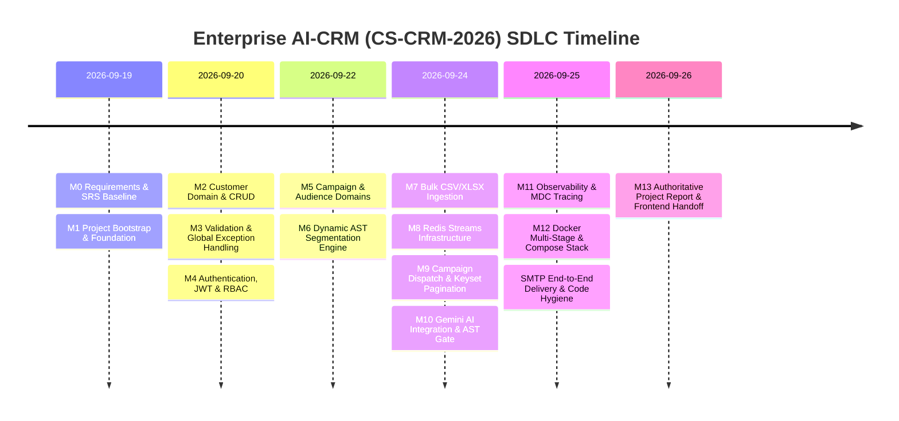
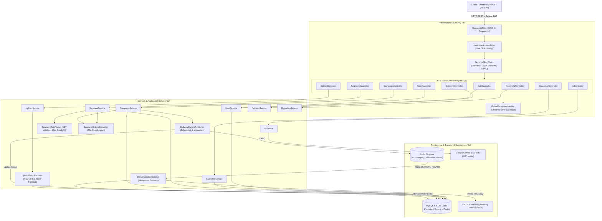
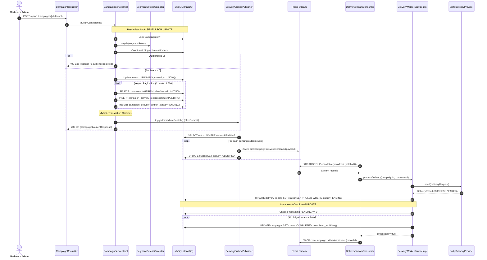
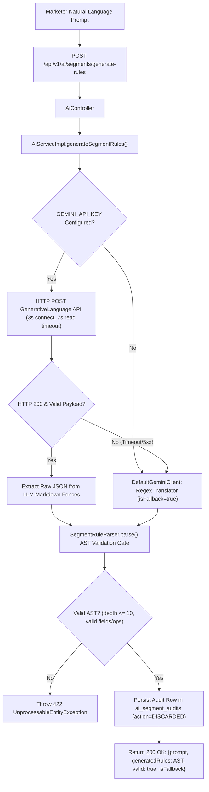
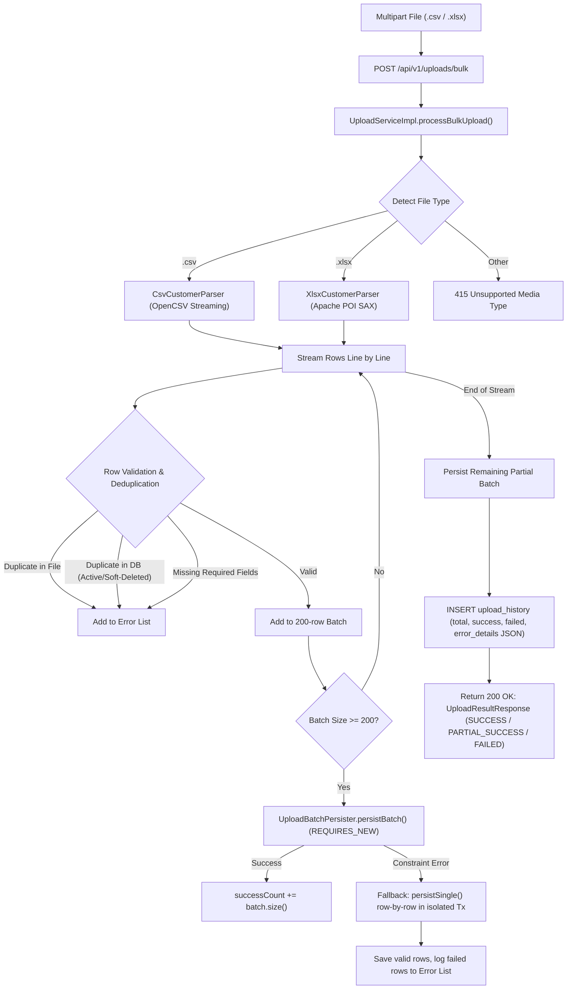
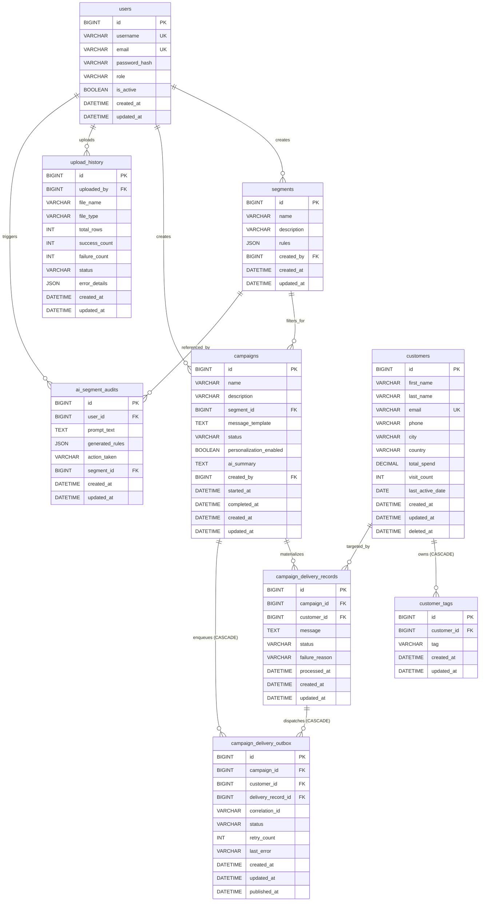
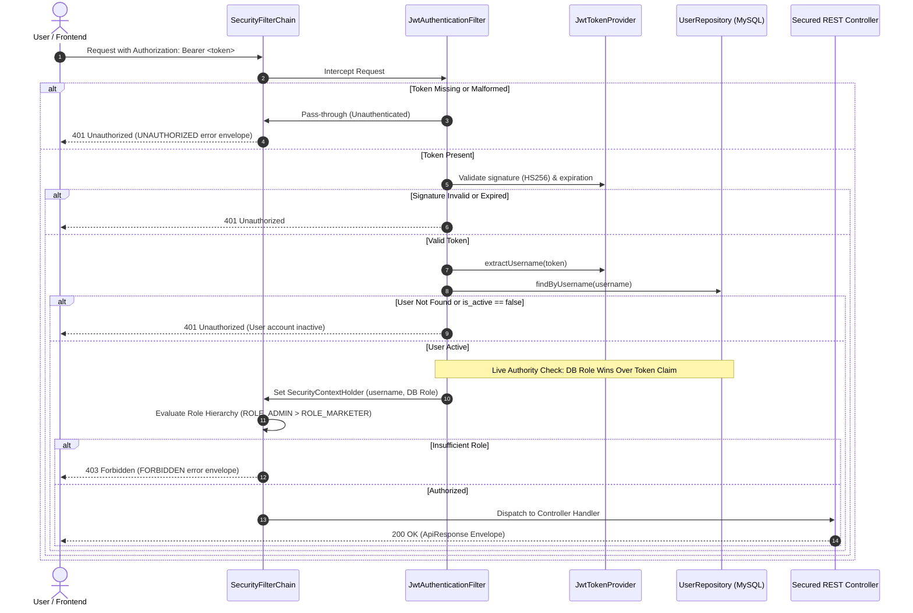

# Enterprise AI-CRM Platform (`CS-CRM-2026`)
## Authoritative A-to-Z Project Report & Frontend Implementation Handoff

---

| Metadata Field | Project Baseline Value |
| :--- | :--- |
| **Document Title** | Authoritative A-to-Z Project Report & Frontend Implementation Handoff |
| **Project Name** | `crm-platform` (Enterprise AI-CRM Platform) |
| **Project Code** | `CS-CRM-2026` |
| **Academic Context / Course** | Advanced Java Programming & Enterprise Systems |
| **Version** | `1.2.0-FINAL` |
| **Document Purpose** | Single Source of Truth for Architecture, SDLC, Backend State, and Frontend UI Handoff |
| **Backend Implementation Status** | **100% Complete** (Hardened, Tested, Dockerized) |
| **Frontend Implementation Status** | **Pending Phase Start** (Full Contract Defined Herein) |
| **Repository Working Tree** | Clean (`main` branch) |
| **Date** | September 2026 |

---

## Table of Contents

1. [Executive Project Identity](#1-executive-project-identity)
2. [Complete SDLC History (M0 through Final Hardening)](#2-complete-sdlc-history)
3. [System Architecture — A to Z](#3-system-architecture--a-to-z)
4. [Package & Codebase Map](#4-package--codebase-map)
5. [Database — Complete Schema & Invariant Reference](#5-database--complete-schema--invariant-reference)
6. [Security — Complete Reference](#6-security--complete-reference)
7. [API Catalog — Exhaustive Specification](#7-api-catalog--exhaustive-specification)
8. [Frontend API Contract & Handoff Guide](#8-frontend-api-contract--handoff-guide)
9. [Segment Engine — Technical Specification](#9-segment-engine--technical-specification)
10. [Customer Lifecycle & Bulk Ingestion Subsystem](#10-customer-lifecycle--bulk-ingestion-subsystem)
11. [Campaign & Delivery Pipeline Subsystem](#11-campaign--delivery-pipeline-subsystem)
12. [Transactional Outbox Architecture](#12-transactional-outbox-architecture)
13. [Redis Streams & Async Infrastructure](#13-redis-streams--async-infrastructure)
14. [Generative AI & Google Gemini Integration](#14-generative-ai--google-gemini-integration)
15. [Observability, Diagnostics & Tracing](#15-observability-diagnostics--tracing)
16. [Docker, Deployment & Containerization](#16-docker-deployment--containerization)
17. [Testing — Complete Test Suite Matrix](#17-testing--complete-test-suite-matrix)
18. [Git & Repository History](#18-git--repository-history)
19. [Configuration & Environment Variable Inventory](#19-configuration--environment-variable-inventory)
20. [Enforced Business Invariants](#20-enforced-business-invariants)
21. [Current Limitations & Environment Constraints](#21-current-limitations--environment-constraints)
22. [Frontend Implementation Handoff & Screen Mapping](#22-frontend-implementation-handoff--screen-mapping)
23. [Frontend TypeScript Data Models](#23-frontend-typescript-data-models)
24. [Frontend UI/UX Design Constraints from Backend](#24-frontend-uiux-design-constraints-from-backend)
25. [Authoritative Project Status](#25-authoritative-project-status)

---

## 1. Executive Project Identity

The **Enterprise AI-CRM Platform (`CS-CRM-2026`)** is a production-grade, event-driven Customer Relationship Management platform engineered to address the scalability, resilience, and operational challenges of enterprise customer data management, dynamic segmentation, automated multi-channel messaging, and generative AI query assistance.

### 1.1 Purpose & Problem Statement
Traditional enterprise CRMs often suffer from three critical architectural flaws:
1. **Monolithic or Unsafe Segmentation:** Complex audience filtering usually leads to dangerous raw SQL string concatenation, catastrophic full-table scans, or inability to combine multi-field criteria with dynamic logical nesting (`AND`/`OR`).
2. **Synchronous Campaign Dispatch Bottlenecks:** Triggering campaigns to tens of thousands of recipients either blocks web worker threads or loses messages when external messaging APIs fail or rate-limit.
3. **Fragile AI Integration:** Direct reliance on non-deterministic LLM output causes runtime schema failures, unexpected query syntax, and vulnerability to external LLM downtime.

`CS-CRM-2026` solves these problems by pairing a **3-tier Modular Monolith** with:
- A recursive **Boolean AST Criteria Compiler** executing dynamic customer segmentation directly in MySQL via type-safe JPA Criteria queries.
- A **Transactional Outbox + Redis Streams Worker Pool** guaranteeing resilient, non-blocking, at-least-once message delivery with idempotent conditional database updates.
- A **Deterministic Fallback Gate** isolating Google Gemini 1.5 Flash behind strict connection/read timeouts and automated AST grammar validation, ensuring 100% CRM uptime even during complete AI provider outages.

### 1.2 Target Users & Roles
The system implements strict Role-Based Access Control (RBAC) with a formal role hierarchy (`ROLE_ADMIN > ROLE_MARKETER`):
- **`ROLE_ADMIN`**: System administrators responsible for platform configuration, user lifecycle (creation, password updates, deactivation), soft-deleted customer purging, campaign destruction, and regulatory AI audit trail inspection.
- **`ROLE_MARKETER`**: Marketing operators and campaign managers responsible for customer management, bulk dataset ingestion, dynamic audience rule creation, campaign composition, execution, and performance reporting.

### 1.3 Core Business Capabilities
- **Customer Lifecycle Management:** Full CRUD operations with phone, location, total spend, visit frequency, and multi-tag support; governed strictly by soft-delete semantics (`deleted_at IS NULL`).
- **High-Throughput Bulk Ingestion:** Streaming CSV (OpenCSV) and Excel XLSX (Apache POI SAX) parsing in 200-row chunks with per-row validation, active and soft-deleted deduplication, and isolated transaction fallback saving valid records while detailing failures.
- **Dynamic Audience Segmentation:** Recursive Abstract Syntax Tree (AST) supporting 5 domain fields, 9 comparison operators, arbitrary nested `AND`/`OR` logic up to depth 10, correlated tag subqueries, and real-time audience size preview.
- **AI-Powered Natural Language Translation:** Google Gemini 1.5 Flash integration transforming natural language requests (e.g. *"High value customers in Chicago who visited more than 5 times"*) into validated JSON ASTs with fallback to a deterministic local translator.
- **Resilient Campaign Pipeline:** Campaign draft editing, audience materialization via keyset pagination (500 per chunk), transactional outbox recording, asynchronous Redis Stream dispatching, consumer group worker processing, and terminal state aggregation.
- **Pluggable Delivery Engine:** Abstract delivery provider interface supporting both a high-fidelity **Simulated Provider** (for stress-testing) and an RFC 5322 **SMTP Provider** (for live email dispatch via MailHog or enterprise mail relays).
- **Executive Analytics & AI Summaries:** Aggregated customer spend/visit metrics, geographic distribution ranking, campaign delivery rates, execution timelines, and LLM-generated executive performance summaries.

### 1.4 Technology Stack Baseline

| Tier / Subsystem | Technology | Exact Version | Configuration & Purpose |
| :--- | :--- | :--- | :--- |
| **Language & Runtime** | Java OpenJDK | **21 LTS** | Core backend language with pattern matching, record syntax, virtual threads compatibility |
| **Web Framework** | Spring Boot | **3.3.3** | WebMVC, Data JPA, Security, Actuator, Mail |
| **Primary Database** | MySQL | **8.4 LTS** | Sole persistent source of truth (`InnoDB`, `utf8mb4`, `READ COMMITTED`) |
| **Connection Pool** | HikariCP | **5.1.0** (bundled) | High-performance pooled JDBC connections (max pool size 10) |
| **Async Messaging** | Redis Streams | **7-alpine** (Lettuce 6.3.2) | Transient message transport queue with consumer groups (`XADD`, `XREADGROUP`, `XACK`, `XCLAIM`) |
| **File Parsing (CSV)** | OpenCSV | **5.9** | Memory-efficient streaming CSV parser |
| **File Parsing (XLSX)** | Apache POI | **5.3.0** (ooxml) | SAX event-driven streaming Excel parser (zero memory spikes) |
| **Generative AI** | Google Gemini 1.5 Flash | REST Client / Spring AI | LLM AST generation & campaign summary with bounded HTTP timeouts |
| **Security & JWT** | Spring Security / JJWT | **6.3.3** / **0.12.6** | Stateless JWT bearer tokens (`HS256`, 1-hour expiry, DB authority verification) |
| **API Documentation** | SpringDoc OpenAPI | **2.6.0** | Swagger UI (`/swagger-ui.html`) and OpenAPI JSON (`/v3/api-docs`) |
| **Observability** | Spring Boot Actuator | **3.3.3** | Health checks (`/actuator/health`), metrics, and MDC request tracing (`X-Request-Id`) |
| **Build Tool** | Apache Maven | **3.9.8+** | Dependency management, compiler plugin (target 21), surefire test runner |
| **Testing Frameworks** | JUnit 5, Mockito, Awaitility, GreenMail | **5.10.3**, **5.11.0**, **4.2.2**, **2.1.0** | Unit, slice, integration, Redis mock, and embedded SMTP mail testing |
| **Containerization** | Docker & Docker Compose | Multi-Stage (Alpine) | Production containerization (`crm-mysql`, `crm-redis`, `crm-smtp`, `crm-app`) |

---

## 2. Complete SDLC History

The platform followed a strict, test-driven, 12-milestone engineering life cycle followed by complete production hardening.



### Detailed Milestone Breakdown

| Milestone | Code/Tag | Primary Objective | Key Deliverables & Classes Added | Schema Additions | API Endpoints Introduced | Git Commit |
| :--- | :--- | :--- | :--- | :--- | :--- | :--- |
| **M0** | `docs(srs)` | Establish approved software requirements baseline | `docs/SRS.md`, `docs/design/*.md` | None | None | `2e97a53` |
| **M1** | `feat(bootstrap)` | Initialize Spring Boot 3.3.3 with Java 21 & package hierarchy | `PlatformApplication`, base `pom.xml`, `application.yml` | None | None | `9936354`, `17c14a1` |
| **M2** | `feat(customer)` | Customer domain, soft delete, and tag persistence | `Customer`, `CustomerTag`, `CustomerRepository`, `CustomerService`, `CustomerController` | `customers`, `customer_tags` | `POST /api/v1/customers`<br>`GET /api/v1/customers/{id}`<br>`PATCH /api/v1/customers/{id}`<br>`DELETE /api/v1/customers/{id}`<br>`GET /api/v1/customers`<br>`GET /api/v1/customers/count` | `27d4b22` |
| **M3** | `feat(validation)` | Declarative validation and uniform error envelope | `GlobalExceptionHandler`, `ApiResponse`, `ErrorResponse`, `PageMetadata`, `ValidationErrorDetail` | None | Centralized error interception across all endpoints | `c8561c6` |
| **M4** | `feat(security)` | JWT bearer authentication, BCrypt, RBAC, and admin self-protection | `User`, `UserRepository`, `UserService`, `SecurityConfig`, `JwtTokenProvider`, `JwtAuthenticationFilter`, `AdminBootstrapRunner` | `users` | `POST /api/v1/auth/login`<br>`POST /api/v1/users`<br>`GET /api/v1/users`<br>`GET /api/v1/users/{id}`<br>`PATCH /api/v1/users/{id}/role`<br>`PATCH /api/v1/users/{id}/deactivate`<br>`PATCH /api/v1/users/{id}/password` | `097dde0`, `87bc28a` |
| **M5** | `feat(domain)` | Audience Segment and Campaign entity models | `Segment`, `Campaign`, `SegmentRepository`, `CampaignRepository`, `MessageTemplateRenderer` | `segments`, `campaigns` | `POST /api/v1/segments`<br>`GET /api/v1/segments/{id}`<br>`PATCH /api/v1/segments/{id}`<br>`DELETE /api/v1/segments/{id}`<br>`GET /api/v1/segments`<br>`POST /api/v1/campaigns`<br>`GET /api/v1/campaigns/{id}`<br>`PATCH /api/v1/campaigns/{id}`<br>`DELETE /api/v1/campaigns/{id}`<br>`GET /api/v1/campaigns` | `66251be` |
| **M6** | `feat(segment)` | Dynamic recursive Boolean AST compiler | `RuleNode`, `LogicalRuleNode`, `ConditionRuleNode`, `RuleField`, `RuleOperator`, `SegmentRuleParser`, `SegmentCriteriaCompiler` | None | `POST /api/v1/segments/{id}/preview`<br>`GET /api/v1/segments/{id}/members` | `9a2275c` |
| **M7** | `feat(upload)` | High-throughput streaming CSV/XLSX bulk ingestion | `CsvCustomerParser`, `XlsxCustomerParser`, `UploadBatchPersister`, `UploadServiceImpl`, `UploadController` | `upload_history` | `POST /api/v1/uploads/bulk`<br>`GET /api/v1/uploads/history` | `90324a2` |
| **M8** | `feat(async)` | Redis Streams producer/consumer worker architecture | `DeliveryStreamProducer`, `DeliveryStreamConsumer`, `DeliveryWorkerServiceImpl` | None | None (Internal async messaging) | `90324a2` |
| **M9** | `feat(launch)` | Pessimistic locking launch, keyset pagination, and ledger tracking | `CampaignServiceImpl.launchCampaign`, `CampaignDeliveryRecord`, `CampaignDeliveryRecordRepository` | `campaign_delivery_records` | `POST /api/v1/campaigns/{id}/launch`<br>`GET /api/v1/campaigns/{id}/delivery-summary`<br>`GET /api/v1/campaigns/{id}/deliveries` | `90324a2` |
| **M10** | `feat(ai)` | Gemini LLM integration, AST validation gate & audit compliance | `GeminiClient`, `DefaultGeminiClient`, `AiServiceImpl`, `AiController`, `AiSegmentAudit` | `ai_segment_audits` | `POST /api/v1/ai/segments/generate-rules`<br>`GET /api/v1/ai/segments/audits`<br>`GET /api/v1/reports/campaigns/{id}/ai-summary` | `90324a2` |
| **M11** | `feat(observe)` | MDC correlation propagation & reporting engine | `RequestIdFilter`, `ReportingServiceImpl`, `ReportingController` | None | `GET /api/v1/reports/campaigns/{id}`<br>`GET /api/v1/reports/customers/overview`<br>`GET /api/v1/reports/campaigns/history` | `90324a2`, `5d4e45b` |
| **M12** | `feat(docker)` | Production Dockerfile, docker-compose, and Swagger OpenAPI | `Dockerfile`, `docker-compose.yml`, `OpenApiConfig` | None | `/swagger-ui.html`<br>`/v3/api-docs` | `53420b6`, `22c39d5` |
| **Hardening** | `fix(delivery)` | Transactional Outbox, safe stream trimming, and SMTP RFC 5322 provider | `CampaignDeliveryOutbox`, `DeliveryOutboxPublisher`, `SmtpDeliveryProvider`, `DeliveryProviderConfig` | `campaign_delivery_outbox` | Automated outbox publisher & PEL reclaim | `e01f389`, `9268b76` |
| **Hygiene** | `refactor(code)` | Resolve compiler warnings, unused imports, normalize tests | Complete codebase code hygiene, Javadoc additions | None | None | `9213da8`, `19a9edb` |

---

## 3. System Architecture — A to Z

The platform is structured following the **3-Tier Modular Monolith Architecture** with decoupled asynchronous background messaging.

### 3.1 Tier Separation
1. **Presentation & Security Tier (`controller`, `security`, `common.filter`):**
   - Intercepts all inbound HTTP requests via `RequestIdFilter`, populating SLF4J MDC with `requestId` and echoing `X-Request-Id` headers.
   - Enforces stateless authentication via `JwtAuthenticationFilter`, verifying bearer tokens and loading live database authority.
   - Maps REST endpoints under `/api/v1/`, delegating immediately to application domain services.
   - Traps all exceptions via `GlobalExceptionHandler`, returning uniform HTTP envelopes.
2. **Application & Domain Service Tier (`service`, `parser`, `compiler`, `util`):**
   - Encapsulates all business rules, transactional boundaries (`@Transactional`), and entity lifecycle logic.
   - Performs streaming file parsing, Boolean AST parsing, JPA specification compilation, and template token interpolation.
   - Enforces optimistic/pessimistic locking and triggers event publication.
3. **Infrastructure & Persistence Tier (`repository`, `delivery.provider`, `ai.client`, `redis`):**
   - **MySQL 8.4:** Authoritative relational persistence utilizing Spring Data JPA, Hibernate 6.5, and HikariCP connection pooling.
   - **Redis 7-alpine:** Ephemeral stream transport (`crm:campaign:deliveries:stream`) buffered by consumer groups.
   - **External Integrations:** JavaMailSender for outbound SMTP, and Google Gemini API for generative AI translation.

### 3.2 End-to-End System Architecture Diagram



### 3.3 Subsystem Execution Workflows

#### 3.3.1 Campaign Dispatch & Delivery Outbox Pipeline


#### 3.3.2 AI Natural Language Query Translation Pipeline


#### 3.3.3 Bulk Ingestion Pipeline


---

## 4. Package & Codebase Map

The root namespace is `com.crm.platform`. There are **84 source Java files** and **52 test Java files** organized into strict domain modules.

```
src/main/java/com/crm/platform/
├── PlatformApplication.java               # Spring Boot Bootstrap Application Entry Point
├── ai/                                    # Generative AI & Gemini Subsystem
│   ├── client/
│   │   ├── DefaultGeminiClient.java       # HTTP REST Client for Gemini 1.5 Flash with fallback
│   │   └── GeminiClient.java              # Strategy Interface for LLM translation
│   ├── controller/
│   │   └── AiController.java              # /api/v1/ai REST Endpoints
│   ├── dto/
│   │   ├── AiCampaignSummaryResponse.java
│   │   ├── AiRuleGenerationRequest.java
│   │   ├── AiRuleGenerationResponse.java
│   │   └── AiSegmentAuditDto.java
│   ├── entity/
│   │   └── AiSegmentAudit.java            # ai_segment_audits JPA Entity
│   ├── repository/
│   │   └── AiSegmentAuditRepository.java
│   └── service/
│       ├── AiService.java
│       └── AiServiceImpl.java
├── campaign/                              # Campaign Orchestration Domain
│   ├── controller/
│   │   └── CampaignController.java        # /api/v1/campaigns REST Endpoints
│   ├── dto/
│   │   ├── CampaignCreateRequest.java
│   │   ├── CampaignLaunchResponse.java
│   │   ├── CampaignResponse.java
│   │   └── CampaignUpdateRequest.java
│   ├── entity/
│   │   ├── Campaign.java                  # campaigns JPA Entity
│   │   └── CampaignStatus.java            # DRAFT, RUNNING, COMPLETED, FAILED
│   ├── repository/
│   │   └── CampaignRepository.java        # Spring Data JPA with findByIdForUpdate
│   ├── service/
│   │   ├── CampaignService.java
│   │   └── CampaignServiceImpl.java       # Keyset pagination launch & state machine
│   └── util/
│       └── MessageTemplateRenderer.java   # {{firstName}}, {{city}} token replacer
├── common/                                # Cross-Cutting Infrastructure & Envelopes
│   ├── config/
│   │   └── OpenApiConfig.java             # SpringDoc Swagger UI Configuration
│   ├── dto/
│   │   ├── ApiResponse.java               # Standard Unified Success Envelope
│   │   ├── ErrorResponse.java             # Standard Unified Error Envelope
│   │   ├── PageMetadata.java              # Standard Pagination Envelope
│   │   └── ValidationErrorDetail.java     # Per-field validation failure detail
│   ├── exception/
│   │   ├── ConflictException.java         # Maps to HTTP 409
│   │   ├── DuplicateResourceException.java# Maps to HTTP 409
│   │   ├── GlobalExceptionHandler.java    # Centralized @RestControllerAdvice
│   │   ├── InvalidRequestException.java   # Maps to HTTP 400
│   │   ├── ResourceNotFoundException.java # Maps to HTTP 404
│   │   ├── ServiceUnavailableException.java# Maps to HTTP 503
│   │   └── UnprocessableEntityException.java# Maps to HTTP 422
│   └── filter/
│       └── RequestIdFilter.java           # X-Request-Id HTTP filter & MDC binder
├── customer/                              # Customer Domain
│   ├── controller/
│   │   └── CustomerController.java        # /api/v1/customers REST Endpoints
│   ├── dto/
│   │   ├── CustomerPatchRequestDto.java
│   │   ├── CustomerRequestDto.java
│   │   ├── CustomerResponseDto.java
│   │   └── CustomerSearchCriteria.java
│   ├── entity/
│   │   ├── Customer.java                  # customers JPA Entity (soft-delete enabled)
│   │   └── CustomerTag.java               # customer_tags JPA Entity
│   ├── mapper/
│   │   └── CustomerMapper.java            # Entity <-> DTO translation
│   ├── repository/
│   │   └── CustomerRepository.java        # Active customer queries (deletedAt IS NULL)
│   └── service/
│       ├── CustomerService.java
│       └── CustomerServiceImpl.java
├── delivery/                              # Messaging Delivery & Worker Pipeline
│   ├── config/
│   │   └── DeliveryProviderConfig.java    # Factory for Simulated vs SMTP provider
│   ├── controller/
│   │   └── DeliveryController.java        # /api/v1/campaigns/{id}/deliveries Endpoints
│   ├── dto/
│   │   ├── DeliveryRecordResponse.java
│   │   └── DeliverySummaryResponse.java
│   ├── entity/
│   │   ├── CampaignDeliveryOutbox.java    # campaign_delivery_outbox JPA Entity
│   │   ├── CampaignDeliveryRecord.java    # campaign_delivery_records JPA Entity
│   │   ├── DeliveryStatus.java            # PENDING, SENT, FAILED
│   │   └── OutboxStatus.java              # PENDING, PUBLISHED, FAILED
│   ├── provider/
│   │   ├── DeliveryProvider.java          # Provider Strategy Interface
│   │   ├── DeliveryRequest.java
│   │   ├── DeliveryResult.java
│   │   ├── SimulatedDeliveryProvider.java # High-throughput simulation provider
│   │   └── SmtpDeliveryProvider.java      # JavaMailSender RFC 5322 MIME provider
│   ├── repository/
│   │   ├── CampaignDeliveryOutboxRepository.java
│   │   └── CampaignDeliveryRecordRepository.java # Idempotent conditional UPDATE
│   └── service/
│       ├── DeliveryOutboxPublisher.java   # Transactional Outbox poller & Min-ID trimmer
│       ├── DeliveryService.java
│       ├── DeliveryServiceImpl.java
│       ├── DeliveryStreamConsumer.java    # Redis Stream worker listener & PEL reclaim
│       ├── DeliveryStreamProducer.java    # Redis Stream producer interface
│       ├── DeliveryWorkerService.java     # Worker message processor
│       ├── DeliveryWorkerServiceImpl.java # Idempotency logic & campaign completion
│       └── RedisDeliveryStreamProducer.java
├── reporting/                             # Analytics & Reporting Subsystem
│   ├── controller/
│   │   └── ReportingController.java       # /api/v1/reports REST Endpoints
│   ├── dto/
│   │   ├── CampaignHistoryItemResponse.java
│   │   ├── CampaignReportResponse.java
│   │   └── CustomerOverviewReportResponse.java
│   ├── service/
│   │   ├── ReportingService.java
│   │   └── ReportingServiceImpl.java      # Spend, visit, location, and KPI aggregations
├── security/                              # Security & Access Control Subsystem
│   ├── CustomUserDetailsService.java      # Spring Security UserDetails adapter
│   ├── JwtAuthenticationFilter.java       # OncePerRequestFilter with live DB authority
│   ├── JwtProperties.java
│   ├── JwtTokenProvider.java              # HMAC-SHA256 token parser & issuer
│   ├── PasswordSecurityConfig.java        # BCryptPasswordEncoder (strength 10)
│   ├── PasswordValidator.java             # 8-72 characters & UTF-8 byte validation
│   ├── SecurityAccessDeniedHandler.java   # Standardized 403 Forbidden response
│   ├── SecurityAuthenticationEntryPoint.java# Standardized 401 Unauthorized response
│   ├── SecurityConfig.java                # SecurityFilterChain, CSRF, Stateless, RBAC
│   ├── bootstrap/
│   │   ├── AdminBootstrapProperties.java
│   │   └── AdminBootstrapRunner.java      # Creates default admin on fresh database
│   ├── controller/
│   │   └── AuthController.java            # /api/v1/auth/login Endpoint
│   ├── dto/
│   │   ├── LoginRequest.java
│   │   └── LoginResponse.java
│   └── service/
│       ├── AuthService.java
│       └── AuthServiceImpl.java
├── segment/                               # Dynamic Segmentation Engine
│   ├── compiler/
│   │   └── SegmentCriteriaCompiler.java   # Type-safe JPA Specification AST compiler
│   ├── controller/
│   │   └── SegmentController.java         # /api/v1/segments REST Endpoints
│   ├── dto/
│   │   ├── SegmentCreateRequest.java
│   │   ├── SegmentPreviewResponse.java
│   │   ├── SegmentResponse.java
│   │   └── SegmentUpdateRequest.java
│   ├── entity/
│   │   └── Segment.java                   # segments JPA Entity with JSON rules column
│   ├── model/
│   │   ├── ConditionRuleNode.java         # Leaf AST node (field, op, value)
│   │   ├── LogicalOperator.java           # AND, OR
│   │   ├── LogicalRuleNode.java           # Composite AST node (operator, conditions)
│   │   ├── RuleField.java                 # city, totalSpend, visitCount, lastActiveDate, tags
│   │   ├── RuleNode.java                  # Sealed/Abstract AST Base Interface
│   │   └── RuleOperator.java              # EQUALS, GREATER_THAN, CONTAINS, IN, etc.
│   ├── parser/
│   │   └── SegmentRuleParser.java         # Jackson AST parser with MAX_DEPTH 10
│   ├── repository/
│   │   └── SegmentRepository.java
│   └── service/
│       ├── SegmentService.java
│       └── SegmentServiceImpl.java
├── upload/                                # High-Volume Bulk Ingestion Subsystem
│   ├── controller/
│   │   └── UploadController.java          # /api/v1/uploads REST Endpoints
│   ├── dto/
│   │   ├── UploadErrorDetail.java         # Row-level failure descriptor
│   │   ├── UploadHistoryDto.java
│   │   └── UploadResultResponse.java
│   ├── entity/
│   │   ├── UploadFileType.java            # CSV, XLSX
│   │   ├── UploadHistory.java             # upload_history JPA Entity
│   │   └── UploadStatus.java              # SUCCESS, PARTIAL_SUCCESS, FAILED
│   ├── parser/
│   │   ├── CsvCustomerParser.java         # OpenCSV streaming parser
│   │   ├── CustomerStreamingParser.java   # Common streaming interface
│   │   ├── ParsedRow.java                 # Unvalidated parsed row abstraction
│   │   └── XlsxCustomerParser.java        # Apache POI SAX streaming parser
│   ├── repository/
│   │   └── UploadHistoryRepository.java
│   └── service/
│       ├── UploadBatchPersister.java      # REQUIRES_NEW isolated transaction persister
│       ├── UploadService.java
│       └── UploadServiceImpl.java         # Deduplication & chunking orchestrator
└── user/                                  # User Management Domain
    ├── controller/
    │   └── UserController.java            # /api/v1/users REST Endpoints
    ├── dto/
    │   ├── UserCreateRequest.java
    │   ├── UserPasswordUpdateRequest.java
    │   ├── UserResponse.java
    │   └── UserRoleUpdateRequest.java
    ├── entity/
    │   ├── RoleEnum.java                  # ROLE_ADMIN, ROLE_MARKETER
    │   └── User.java                      # users JPA Entity
    ├── repository/
    │   └── UserRepository.java
    └── service/
        ├── UserService.java
        └── UserServiceImpl.java           # Admin self-protection & password updates
```

---

## 5. Database — Complete Schema & Invariant Reference

The database is exclusively **MySQL 8.4 LTS** (`InnoDB` storage engine, `utf8mb4` character set, `utf8mb4_0900_ai_ci` collation). Hibernate DDL auto-generation is set to `validate`, ensuring the database schema is strictly controlled via `schema.sql`.

### 5.1 Entity Relationship Diagram



### 5.2 Exhaustive Table Specifications

#### 1. `users`
- **Purpose:** Stores authenticated administrative and marketing staff accounts.
- **Columns:**
  - `id`: `BIGINT UNSIGNED AUTO_INCREMENT PRIMARY KEY`
  - `username`: `VARCHAR(50) NOT NULL UNIQUE` (`uq_users_username`)
  - `email`: `VARCHAR(255) NOT NULL UNIQUE` (`uq_users_email`)
  - `password_hash`: `VARCHAR(255) NOT NULL` (BCrypt encoded)
  - `role`: `VARCHAR(20) NOT NULL` (Checked by `chk_users_role IN ('ROLE_ADMIN', 'ROLE_MARKETER')`)
  - `is_active`: `BOOLEAN NOT NULL DEFAULT TRUE`
  - `created_at`: `DATETIME(6) NOT NULL`
  - `updated_at`: `DATETIME(6) NOT NULL`
- **Indexes:** `idx_users_username` (`username`), `idx_users_email` (`email`)

#### 2. `customers`
- **Purpose:** Core customer entity records.
- **Columns:**
  - `id`: `BIGINT UNSIGNED AUTO_INCREMENT PRIMARY KEY`
  - `first_name`: `VARCHAR(100) NOT NULL`
  - `last_name`: `VARCHAR(100) NOT NULL`
  - `email`: `VARCHAR(255) NOT NULL UNIQUE` (`uq_customers_email`)
  - `phone`: `VARCHAR(30) NULL`
  - `city`: `VARCHAR(100) NULL`
  - `country`: `VARCHAR(100) NULL`
  - `total_spend`: `DECIMAL(12,2) NOT NULL DEFAULT 0.00`
  - `visit_count`: `INT UNSIGNED NOT NULL DEFAULT 0`
  - `last_active_date`: `DATE NULL`
  - `created_at`: `DATETIME(6) NOT NULL`
  - `updated_at`: `DATETIME(6) NOT NULL`
  - `deleted_at`: `DATETIME(6) NULL DEFAULT NULL`
- **Indexes:**
  - Composite covering indexes for high-speed dynamic segmentation:
    - `idx_cust_del_spent` (`deleted_at, total_spend`)
    - `idx_cust_del_city` (`deleted_at, city`)
    - `idx_cust_del_visits` (`deleted_at, visit_count`)
    - `idx_cust_del_last_active` (`deleted_at, last_active_date`)
    - `idx_cust_created_at` (`created_at`)
- **Crucial Invariant:** **There is NO `status` column.** Customer activity is determined exclusively by `deleted_at IS NULL`. Soft-deleted rows have `deleted_at != NULL` and remain physically present to prevent duplicate key collisions while being filtered out of active queries.

#### 3. `customer_tags`
- **Purpose:** Multi-valued tags assigned to customers (e.g. `VIP`, `NEWSLETTER`, `CHURN_RISK`).
- **Columns:**
  - `id`: `BIGINT UNSIGNED AUTO_INCREMENT PRIMARY KEY`
  - `customer_id`: `BIGINT UNSIGNED NOT NULL` (FK $\to$ `customers.id`, `ON DELETE CASCADE`)
  - `tag`: `VARCHAR(50) NOT NULL`
  - `created_at`: `DATETIME(6) NOT NULL`
  - `updated_at`: `DATETIME(6) NOT NULL`
- **Constraints:** Unique pair constraint `uq_customer_tag (customer_id, tag)`
- **Indexes:** `idx_tag (tag)`, `idx_cust_tags_tag_cust (tag, customer_id)`

#### 4. `segments`
- **Purpose:** Persistent dynamic audience criteria definitions stored as Boolean AST JSON.
- **Columns:**
  - `id`: `BIGINT UNSIGNED AUTO_INCREMENT PRIMARY KEY`
  - `name`: `VARCHAR(100) NOT NULL`
  - `description`: `VARCHAR(500) NULL`
  - `rules`: `JSON NOT NULL` (Strongly-typed AST JSON tree)
  - `created_by`: `BIGINT UNSIGNED NOT NULL` (FK $\to$ `users.id`, `ON DELETE RESTRICT`)
  - `created_at`: `DATETIME(6) NOT NULL`
  - `updated_at`: `DATETIME(6) NOT NULL`
- **Indexes:** `idx_seg_created_by (created_by)`

#### 5. `campaigns`
- **Purpose:** Outbound marketing initiatives bound to target segments.
- **Columns:**
  - `id`: `BIGINT UNSIGNED AUTO_INCREMENT PRIMARY KEY`
  - `name`: `VARCHAR(150) NOT NULL`
  - `description`: `VARCHAR(500) NULL`
  - `segment_id`: `BIGINT UNSIGNED NOT NULL` (FK $\to$ `segments.id`, `ON DELETE RESTRICT`)
  - `message_template`: `TEXT NOT NULL`
  - `status`: `VARCHAR(20) NOT NULL DEFAULT 'DRAFT'` (`chk_campaigns_status IN ('DRAFT', 'RUNNING', 'COMPLETED', 'FAILED')`)
  - `personalization_enabled`: `BOOLEAN NOT NULL DEFAULT FALSE`
  - `ai_summary`: `TEXT NULL`
  - `created_by`: `BIGINT UNSIGNED NOT NULL` (FK $\to$ `users.id`, `ON DELETE RESTRICT`)
  - `started_at`: `DATETIME(6) NULL`
  - `completed_at`: `DATETIME(6) NULL`
  - `created_at`: `DATETIME(6) NOT NULL`
  - `updated_at`: `DATETIME(6) NOT NULL`
- **Indexes:** `idx_camp_status (status)`, `idx_camp_segment_id (segment_id)`, `idx_camp_created_by (created_by)`

#### 6. `upload_history`
- **Purpose:** Audit ledger for bulk CSV and Excel data ingestion operations.
- **Columns:**
  - `id`: `BIGINT UNSIGNED AUTO_INCREMENT PRIMARY KEY`
  - `uploaded_by`: `BIGINT UNSIGNED NOT NULL` (FK $\to$ `users.id`, `ON DELETE RESTRICT`)
  - `file_name`: `VARCHAR(255) NOT NULL`
  - `file_type`: `VARCHAR(10) NOT NULL` (`chk_upload_file_type IN ('CSV', 'XLSX')`)
  - `total_rows`: `INT UNSIGNED NOT NULL DEFAULT 0`
  - `success_count`: `INT UNSIGNED NOT NULL DEFAULT 0`
  - `failure_count`: `INT UNSIGNED NOT NULL DEFAULT 0`
  - `status`: `VARCHAR(20) NOT NULL` (`chk_upload_status IN ('SUCCESS', 'PARTIAL_SUCCESS', 'FAILED')`)
  - `error_details`: `JSON NULL` (Array of line-number, email, and validation error messages)
  - `created_at`: `DATETIME(6) NOT NULL`
  - `updated_at`: `DATETIME(6) NOT NULL`
- **Indexes:** `idx_upload_user (uploaded_by)`, `idx_upload_created (created_at)`

#### 7. `campaign_delivery_records`
- **Purpose:** The permanent delivery ledger tracking individual message dispatch obligations.
- **Columns:**
  - `id`: `BIGINT UNSIGNED AUTO_INCREMENT PRIMARY KEY`
  - `campaign_id`: `BIGINT UNSIGNED NOT NULL` (FK $\to$ `campaigns.id`, `ON DELETE RESTRICT`)
  - `customer_id`: `BIGINT UNSIGNED NOT NULL` (FK $\to$ `customers.id`, `ON DELETE RESTRICT`)
  - `message`: `TEXT NOT NULL` (Fully rendered message with personalization tags replaced)
  - `status`: `VARCHAR(20) NOT NULL DEFAULT 'PENDING'` (`chk_deliv_status IN ('PENDING', 'SENT', 'FAILED')`)
  - `failure_reason`: `VARCHAR(500) NULL`
  - `processed_at`: `DATETIME(6) NULL`
  - `created_at`: `DATETIME(6) NOT NULL`
  - `updated_at`: `DATETIME(6) NOT NULL`
- **Constraints:** Strict deduplication constraint: `uq_campaign_customer (campaign_id, customer_id)` ensures a customer can never receive duplicate messages for the same campaign.
- **Indexes:** `idx_deliv_cust_id (customer_id)`, `idx_deliv_camp_status (campaign_id, status)`

#### 8. `ai_segment_audits`
- **Purpose:** Regulatory compliance audit trail capturing natural language prompts and generated AST rules.
- **Columns:**
  - `id`: `BIGINT UNSIGNED AUTO_INCREMENT PRIMARY KEY`
  - `user_id`: `BIGINT UNSIGNED NOT NULL` (FK $\to$ `users.id`, `ON DELETE RESTRICT`)
  - `prompt_text`: `TEXT NOT NULL`
  - `generated_rules`: `JSON NOT NULL`
  - `action_taken`: `VARCHAR(20) NOT NULL` (`chk_ai_audit_action IN ('SAVED', 'DISCARDED')`)
  - `segment_id`: `BIGINT UNSIGNED NULL` (FK $\to$ `segments.id`, `ON DELETE SET NULL`)
  - `created_at`: `DATETIME(6) NOT NULL`
  - `updated_at`: `DATETIME(6) NOT NULL`
- **Indexes:** `idx_ai_audit_user (user_id)`, `idx_ai_audit_segment (segment_id)`

#### 9. `campaign_delivery_outbox`
- **Purpose:** Transactional Outbox pattern guaranteeing zero message loss between MySQL commit and Redis Stream publishing.
- **Columns:**
  - `id`: `BIGINT UNSIGNED AUTO_INCREMENT PRIMARY KEY`
  - `campaign_id`: `BIGINT UNSIGNED NOT NULL` (FK $\to$ `campaigns.id`, `ON DELETE CASCADE`)
  - `customer_id`: `BIGINT UNSIGNED NOT NULL`
  - `delivery_record_id`: `BIGINT UNSIGNED NOT NULL` (FK $\to$ `campaign_delivery_records.id`, `ON DELETE CASCADE`)
  - `correlation_id`: `VARCHAR(100) NULL` (Propagates `X-Request-Id` across threads)
  - `status`: `VARCHAR(20) NOT NULL DEFAULT 'PENDING'` (`chk_outbox_status IN ('PENDING', 'PUBLISHED', 'FAILED')`)
  - `retry_count`: `INT UNSIGNED NOT NULL DEFAULT 0`
  - `last_error`: `VARCHAR(500) NULL`
  - `created_at`: `DATETIME(6) NOT NULL`
  - `updated_at`: `DATETIME(6) NOT NULL`
  - `published_at`: `DATETIME(6) NULL`
- **Indexes:** `idx_outbox_status_created (status, created_at)`, `idx_outbox_camp_id (campaign_id)`

---

## 6. Security — Complete Reference

The platform adheres to an enterprise zero-trust perimeter utilizing stateless JSON Web Tokens (JJWT) with real-time database validation.



### 6.1 Cryptographic & Token Specifications
- **Algorithm:** HMAC-SHA256 (`HS256`).
- **Secret Key:** Injected via `JWT_SECRET`. Minimum 32 UTF-8 bytes required (validated on startup).
- **Issuer:** Standardized to `cs-crm-2026`.
- **Expiration:** `3600000 ms` (Exactly 1 hour).
- **Token Claims:**
  - `sub`: Username of the principal.
  - `role`: Role string (`ROLE_ADMIN` or `ROLE_MARKETER`).
  - `iss`: `cs-crm-2026`.
  - `iat`: Epoch timestamp issued.
  - `exp`: Epoch timestamp expiration (1 hour from issue).

### 6.2 Authentication Logic & Admin Bootstrap
- **Login Endpoint:** `POST /api/v1/auth/login`. Accepts `username` (or `email`) and raw `password`.
- **Password Hashing:** `BCryptPasswordEncoder` configured with strength `10`.
- **Password Validation (`PasswordValidator`):**
  - Minimum 8 characters, maximum 72 characters.
  - Hard constraint: Password cannot exceed 72 UTF-8 bytes (enforcing the strict BCrypt internal algorithm boundary to prevent silent truncation attacks).
- **Bootstrap Initialization (`AdminBootstrapRunner`):** On startup, if `users` table contains 0 records, it automatically seeds an initial admin account configured via environment variables:
  - Username: `${BOOTSTRAP_ADMIN_USERNAME:admin}`
  - Email: `${BOOTSTRAP_ADMIN_EMAIL:admin@crm.internal}`
  - Password: `${BOOTSTRAP_ADMIN_PASSWORD:AdminPassword123!}`
  - Role: `ROLE_ADMIN`

### 6.3 Real-Time Authority Check & Self-Protection Invariants
1. **Live Authority Check in `JwtAuthenticationFilter`:** The filter does not blindly trust the role embedded inside the token claims. For every authenticated request, it queries `users` table in MySQL. The database role overrides the token claim, and if `is_active` has been set to `false`, the user is immediately denied access.
2. **Role Hierarchy:** Configured via `RoleHierarchyImpl.fromHierarchy("ROLE_ADMIN > ROLE_MARKETER")`. Any endpoint permitting `ROLE_MARKETER` automatically permits `ROLE_ADMIN`.
3. **Administrator Self-Protection:**
   - An administrator cannot deactivate their own account via `PATCH /api/v1/users/{id}/deactivate` (returns `400 Bad Request: Administrators cannot deactivate their own account`).
   - An administrator cannot demote their own account to `ROLE_MARKETER` via `PATCH /api/v1/users/{id}/role` (returns `400 Bad Request: Administrators cannot demote their own account`).

### 6.4 Endpoint Authorization Matrix

| Endpoint Route Pattern | HTTP Method | Permitted Roles | Failure HTTP Status |
| :--- | :--- | :--- | :--- |
| `/api/v1/auth/login` | `POST` | `permitAll()` (Anonymous) | `401 Unauthorized` |
| `/swagger-ui/**`, `/v3/api-docs/**` | `GET` | `permitAll()` (Anonymous) | N/A |
| `/actuator/**` | `GET` | `permitAll()` (Anonymous) | N/A |
| `/api/v1/users/**` | `ALL` | `ROLE_ADMIN` | `403 Forbidden` |
| `/api/v1/customers/**` | `DELETE` | `ROLE_ADMIN` | `403 Forbidden` |
| `/api/v1/customers/**` | `GET, POST, PATCH` | `ROLE_ADMIN`, `ROLE_MARKETER` | `401` / `403` |
| `/api/v1/campaigns/**` | `DELETE` | `ROLE_ADMIN` | `403 Forbidden` |
| `/api/v1/campaigns/**` | `GET, POST, PATCH` | `ROLE_ADMIN`, `ROLE_MARKETER` | `401` / `403` |
| `/api/v1/segments/**` | `ALL` | `ROLE_ADMIN`, `ROLE_MARKETER` | `401` / `403` |
| `/api/v1/uploads/**` | `POST, GET` | `ROLE_ADMIN`, `ROLE_MARKETER` | `401` / `403` |
| `/api/v1/ai/segments/audits` | `GET` | `ROLE_ADMIN` | `403 Forbidden` |
| `/api/v1/ai/segments/generate-rules`| `POST` | `ROLE_ADMIN`, `ROLE_MARKETER` | `401` / `403` |
| `/api/v1/reports/**` | `GET` | `ROLE_ADMIN`, `ROLE_MARKETER` | `401` / `403` |

---

## 7. API Catalog — Exhaustive Specification

Every endpoint uses the `/api/v1/` prefix and returns uniform JSON envelopes.

### 7.1 Authentication (`AuthController`)

#### `POST /api/v1/auth/login`
- **Purpose:** Authenticates credentials and returns bearer token.
- **Security:** Public (`permitAll()`).
- **Request Body:**
  ```json
  {
    "username": "admin",
    "password": "AdminPassword123!"
  }
  ```
  *(Note: `username` field also accepts an email address).*
- **Response (200 OK):**
  ```json
  {
    "success": true,
    "data": {
      "token": "eyJhbGciOiJIUzI1NiIsInR5cCI6IkpXVCJ9...",
      "tokenType": "Bearer",
      "userId": 1,
      "username": "admin",
      "email": "admin@crm.internal",
      "role": "ROLE_ADMIN",
      "expiresInMs": 3600000
    },
    "metadata": {
      "timestamp": "2026-09-26T12:00:00.000Z",
      "requestId": "9b1deb4d-3b7d-4bad-9bdd-2b0d7b3dcb6d"
    }
  }
  ```
- **Error Codes:** `400 VALIDATION_FAILED`, `401 UNAUTHORIZED`.

---

### 7.2 User Administration (`UserController`) — Admin Only

#### `POST /api/v1/users`
- **Purpose:** Create a new user account.
- **Security:** `ROLE_ADMIN`.
- **Request Body:**
  ```json
  {
    "username": "marketer_jane",
    "email": "jane@crm.internal",
    "password": "Password123!",
    "role": "ROLE_MARKETER"
  }
  ```
- **Response (201 Created):** `ApiResponse<UserResponse>` with `Location: /api/v1/users/{id}`.

#### `GET /api/v1/users`
- **Purpose:** Paginated list of user accounts.
- **Security:** `ROLE_ADMIN`.
- **Query Parameters:** `page` (default 0), `size` (default 10), `sort` (default `id`).
- **Response (200 OK):** `ApiResponse<List<UserResponse>>` with pagination metadata.

#### `GET /api/v1/users/{id}`
- **Purpose:** Retrieve user details by ID.
- **Security:** `ROLE_ADMIN`.
- **Response (200 OK):** `ApiResponse<UserResponse>`.
- **Error Codes:** `404 RESOURCE_NOT_FOUND`.

#### `PATCH /api/v1/users/{id}/role`
- **Purpose:** Update user role.
- **Security:** `ROLE_ADMIN`.
- **Request Body:** `{"role": "ROLE_ADMIN"}`.
- **Error Codes:** `400 BAD_REQUEST` if admin attempts to demote own account.

#### `PATCH /api/v1/users/{id}/deactivate`
- **Purpose:** Deactivate a user account.
- **Security:** `ROLE_ADMIN`.
- **Error Codes:** `400 BAD_REQUEST` if admin attempts to deactivate own account.

#### `PATCH /api/v1/users/{id}/password`
- **Purpose:** Reset/update a user's password.
- **Security:** `ROLE_ADMIN`.
- **Request Body:** `{"password": "NewSecretPassword123!"}`.

---

### 7.3 Customers (`CustomerController`)

#### `POST /api/v1/customers`
- **Purpose:** Create a single customer record.
- **Security:** `ROLE_ADMIN`, `ROLE_MARKETER`.
- **Request Body:**
  ```json
  {
    "firstName": "John",
    "lastName": "Doe",
    "email": "john.doe@example.com",
    "phone": "+1-555-0199",
    "city": "Chicago",
    "country": "USA",
    "totalSpend": 1250.50,
    "visitCount": 8,
    "lastActiveDate": "2026-09-15",
    "tags": ["VIP", "LOYALTY"]
  }
  ```
- **Response (201 Created):** `ApiResponse<CustomerResponseDto>` with `Location: /api/v1/customers/{id}`.
- **Error Codes:** `400 VALIDATION_FAILED`, `409 DUPLICATE_RESOURCE` (email already exists in active or soft-deleted state).

#### `GET /api/v1/customers/{id}`
- **Purpose:** Retrieve active customer details.
- **Security:** `ROLE_ADMIN`, `ROLE_MARKETER`.
- **Response (200 OK):** `ApiResponse<CustomerResponseDto>`. Soft-deleted returns `404 RESOURCE_NOT_FOUND`.

#### `PATCH /api/v1/customers/{id}`
- **Purpose:** Partial update of customer fields.
- **Security:** `ROLE_ADMIN`, `ROLE_MARKETER`.
- **Request Body:** Any subset of customer fields.
- **Response (200 OK):** `ApiResponse<CustomerResponseDto>`.

#### `DELETE /api/v1/customers/{id}`
- **Purpose:** Soft-deletes a customer record (sets `deleted_at = NOW()`).
- **Security:** `ROLE_ADMIN` only. Marketer calling this receives `403 FORBIDDEN`.
- **Response (204 No Content):** Empty body.

#### `GET /api/v1/customers`
- **Purpose:** Dynamic search and filtering over active customers.
- **Security:** `ROLE_ADMIN`, `ROLE_MARKETER`.
- **Query Parameters:** `firstName`, `lastName`, `email`, `city`, `country`, `tag`, `page` (default 0), `size` (default 20), `sort` (allowed sort fields: `createdAt`, `lastName`, `totalSpend`; default `createdAt,desc`).
- **Response (200 OK):** `ApiResponse<List<CustomerResponseDto>>` with pagination metadata.

#### `GET /api/v1/customers/count`
- **Purpose:** Count total active customers (`deleted_at IS NULL`).
- **Security:** `ROLE_ADMIN`, `ROLE_MARKETER`.
- **Response (200 OK):**
  ```json
  {
    "success": true,
    "data": {
      "totalActiveCustomers": 1042
    },
    "metadata": { ... }
  }
  ```

---

### 7.4 Segments (`SegmentController`)

#### `POST /api/v1/segments`
- **Purpose:** Create dynamic segmentation rule tree.
- **Security:** `ROLE_ADMIN`, `ROLE_MARKETER`.
- **Request Body:**
  ```json
  {
    "name": "High Value Chicago Customers",
    "description": "Spends over 1000 and lives in Chicago",
    "rules": {
      "operator": "AND",
      "conditions": [
        {"field": "city", "op": "EQUALS", "value": "Chicago"},
        {"field": "totalSpend", "op": "GREATER_THAN", "value": 1000.00}
      ]
    }
  }
  ```
- **Response (201 Created):** `ApiResponse<SegmentResponse>`.
- **Error Codes:** `400 BAD_REQUEST` (malformed JSON AST, depth > 10, invalid field/operator).

#### `GET /api/v1/segments`
- **Purpose:** Paginated list of segments.
- **Security:** `ROLE_ADMIN`, `ROLE_MARKETER`.
- **Response (200 OK):** `ApiResponse<List<SegmentResponse>>`.

#### `GET /api/v1/segments/{id}`
- **Purpose:** Retrieve segment definition and JSON rules.
- **Security:** `ROLE_ADMIN`, `ROLE_MARKETER`.

#### `PATCH /api/v1/segments/{id}`
- **Purpose:** Update segment name, description, or rules.
- **Security:** `ROLE_ADMIN`, `ROLE_MARKETER`.

#### `DELETE /api/v1/segments/{id}`
- **Purpose:** Delete a segment.
- **Security:** `ROLE_ADMIN`, `ROLE_MARKETER`.
- **Error Codes:** `409 CONFLICT` if segment is referenced by existing campaigns.

#### `POST /api/v1/segments/{id}/preview`
- **Purpose:** Fast evaluation of matching active customer count without returning row data.
- **Security:** `ROLE_ADMIN`, `ROLE_MARKETER`.
- **Response (200 OK):**
  ```json
  {
    "success": true,
    "data": {
      "segmentId": 5,
      "segmentName": "High Value Chicago Customers",
      "matchingCount": 184
    },
    "metadata": { ... }
  }
  ```

#### `GET /api/v1/segments/{id}/members`
- **Purpose:** Paginated list of active customers who currently satisfy the segment rules.
- **Security:** `ROLE_ADMIN`, `ROLE_MARKETER`.
- **Query Parameters:** `page`, `size` (default 20), `sort`.
- **Response (200 OK):** `ApiResponse<List<CustomerResponseDto>>` with pagination.

---

### 7.5 Campaigns & Delivery (`CampaignController`, `DeliveryController`)

#### `POST /api/v1/campaigns`
- **Purpose:** Create campaign draft.
- **Security:** `ROLE_ADMIN`, `ROLE_MARKETER`.
- **Request Body:**
  ```json
  {
    "name": "Summer VIP Offer",
    "description": "Exclusive summer discount",
    "segmentId": 5,
    "messageTemplate": "Hi {{firstName}}, enjoy 20% off in {{city}}! Your total spend: ${{totalSpend}}.",
    "personalizationEnabled": true
  }
  ```
- **Response (201 Created):** `ApiResponse<CampaignResponse>` (status `DRAFT`).

#### `GET /api/v1/campaigns`
- **Purpose:** Paginated list of campaigns, optionally filtered by status.
- **Security:** `ROLE_ADMIN`, `ROLE_MARKETER`.
- **Query Parameters:** `status` (`DRAFT`, `RUNNING`, `COMPLETED`, `FAILED`), `page`, `size`.

#### `GET /api/v1/campaigns/{id}`
- **Purpose:** Retrieve campaign details.

#### `PATCH /api/v1/campaigns/{id}`
- **Purpose:** Edit campaign draft fields.
- **Error Codes:** `409 CONFLICT` if campaign status is NOT `DRAFT`.

#### `DELETE /api/v1/campaigns/{id}`
- **Purpose:** Delete campaign draft.
- **Security:** `ROLE_ADMIN` only.
- **Error Codes:** `409 CONFLICT` if campaign status is NOT `DRAFT`.

#### `POST /api/v1/campaigns/{id}/launch`
- **Purpose:** Materializes segment audience, locks row, creates outbox records, and initiates Redis async dispatch.
- **Security:** `ROLE_ADMIN`, `ROLE_MARKETER`.
- **Response (200 OK):**
  ```json
  {
    "success": true,
    "data": {
      "campaignId": 12,
      "status": "RUNNING",
      "materializedAudienceCount": 184,
      "message": "Campaign transitioned to RUNNING and delivery processing has been initiated.",
      "launchedAt": "2026-09-26T12:30:00.000Z"
    },
    "metadata": { ... }
  }
  ```
- **Error Codes:**
  - `400 BAD_REQUEST` if campaign is NOT in `DRAFT` status.
  - `400 BAD_REQUEST` if segment evaluates to 0 active customers (remains in `DRAFT`).

#### `GET /api/v1/campaigns/{id}/delivery-summary`
- **Purpose:** High-level delivery metrics counter.
- **Response (200 OK):**
  ```json
  {
    "success": true,
    "data": {
      "campaignId": 12,
      "campaignName": "Summer VIP Offer",
      "campaignStatus": "RUNNING",
      "totalAudience": 184,
      "sentCount": 150,
      "failedCount": 2,
      "pendingCount": 32,
      "deliveryRate": 81.52
    },
    "metadata": { ... }
  }
  ```

#### `GET /api/v1/campaigns/{id}/deliveries`
- **Purpose:** Paginated audit ledger of individual recipient delivery records.
- **Query Parameters:** `status` (`PENDING`, `SENT`, `FAILED`), `page`, `size`.
- **Response (200 OK):** `ApiResponse<List<DeliveryRecordResponse>>` with pagination.

---

### 7.6 Bulk Ingestion (`UploadController`)

#### `POST /api/v1/uploads/bulk`
- **Purpose:** Upload and ingest customer records from CSV or Excel.
- **Security:** `ROLE_ADMIN`, `ROLE_MARKETER`.
- **Content-Type:** `multipart/form-data`.
- **Form Field:** `file` (MultipartFile, max 10MB).
- **Accepted File Extensions:** `.csv`, `.xlsx`.
- **Response (200 OK):**
  ```json
  {
    "success": true,
    "data": {
      "uploadId": 3,
      "fileName": "august_leads.csv",
      "status": "PARTIAL_SUCCESS",
      "totalRows": 500,
      "successCount": 492,
      "failedCount": 8,
      "errors": [
        {
          "rowNumber": 14,
          "email": "bad-email@",
          "error": "Email must be a valid email address"
        },
        {
          "rowNumber": 45,
          "email": "existing@example.com",
          "error": "Customer with email already exists: existing@example.com"
        }
      ]
    },
    "metadata": { ... }
  }
  ```
- **Status Values:**
  - `SUCCESS`: All rows valid and saved.
  - `PARTIAL_SUCCESS`: Some rows saved, errors recorded for invalid rows.
  - `FAILED`: Zero rows saved or fatal file structure error.
- **Error Codes:** `400 BAD_REQUEST` (empty file), `415 UNSUPPORTED_MEDIA_TYPE` (not CSV/XLSX).

#### `GET /api/v1/uploads/history`
- **Purpose:** Paginated audit log of all historical upload operations.
- **Security:** `ROLE_ADMIN`, `ROLE_MARKETER`.
- **Response (200 OK):** `ApiResponse<List<UploadHistoryDto>>` with pagination.

---

### 7.7 Generative AI (`AiController`)

#### `POST /api/v1/ai/segments/generate-rules`
- **Purpose:** Translates natural language prompt into Boolean AST rules.
- **Security:** `ROLE_ADMIN`, `ROLE_MARKETER`.
- **Request Body:**
  ```json
  {
    "prompt": "Customers living in Chicago who have spent more than 1000 dollars"
  }
  ```
- **Response (200 OK):**
  ```json
  {
    "success": true,
    "data": {
      "prompt": "Customers living in Chicago who have spent more than 1000 dollars",
      "generatedRules": {
        "combinator": "AND",
        "conditions": [
          {"field": "city", "operator": "EQUALS", "value": "Chicago"},
          {"field": "totalSpend", "operator": "GREATER_THAN", "value": 1000.0}
        ]
      },
      "valid": true,
      "isFallback": false
    },
    "metadata": { ... }
  }
  ```
  *(Note: If `GEMINI_API_KEY` is omitted or Gemini times out, `isFallback` will be `true`, indicating the response was generated by the local deterministic fallback translator).*
- **Error Codes:** `400 BAD_REQUEST` (empty prompt), `422 UNPROCESSABLE_ENTITY` (LLM returned rules failing AST validation).

#### `GET /api/v1/ai/segments/audits`
- **Purpose:** Compliance audit ledger of all generated AI prompts and rules.
- **Security:** `ROLE_ADMIN` only.
- **Response (200 OK):** `ApiResponse<List<AiSegmentAuditDto>>` with pagination.

---

### 7.8 Reporting & Analytics (`ReportingController`)

#### `GET /api/v1/reports/customers/overview`
- **Purpose:** High-level customer demographic and spend KPIs.
- **Security:** `ROLE_ADMIN`, `ROLE_MARKETER`.
- **Response (200 OK):**
  ```json
  {
    "success": true,
    "data": {
      "totalActiveCustomers": 1042,
      "grossSpend": 450200.75,
      "averageSpend": 432.05,
      "totalVisits": 14250,
      "averageVisits": 13.68,
      "topLocations": [
        {"city": "Chicago", "customerCount": 312},
        {"city": "New York", "customerCount": 245},
        {"city": "San Francisco", "customerCount": 180}
      ]
    },
    "metadata": { ... }
  }
  ```

#### `GET /api/v1/reports/campaigns/{id}`
- **Purpose:** Deep analytics report for a specific campaign.
- **Security:** `ROLE_ADMIN`, `ROLE_MARKETER`.
- **Response (200 OK):**
  ```json
  {
    "success": true,
    "data": {
      "campaignId": 12,
      "campaignName": "Summer VIP Offer",
      "status": "COMPLETED",
      "targetAudience": 184,
      "metrics": {
        "sentCount": 182,
        "failedCount": 2,
        "deliveryRate": 98.91
      },
      "timeline": {
        "launchedAt": "2026-09-26T12:30:00.000Z",
        "completedAt": "2026-09-26T12:30:15.000Z",
        "durationSeconds": 15
      }
    },
    "metadata": { ... }
  }
  ```

#### `GET /api/v1/reports/campaigns/{id}/ai-summary`
- **Purpose:** Generates or retrieves an executive AI-written summary of campaign performance.
- **Security:** `ROLE_ADMIN`, `ROLE_MARKETER`.
- **Response (200 OK):**
  ```json
  {
    "success": true,
    "data": {
      "campaignId": 12,
      "summary": "Campaign 'Summer VIP Offer' reached 98.91% of its 184 target customers in 15 seconds with only 2 delivery failures.",
      "generatedAt": "2026-09-26T12:31:00.000Z"
    },
    "metadata": { ... }
  }
  ```

#### `GET /api/v1/reports/campaigns/history`
- **Purpose:** Comparative list of historical campaign outcomes.
- **Security:** `ROLE_ADMIN`, `ROLE_MARKETER`.
- **Response (200 OK):** `ApiResponse<List<CampaignHistoryItemResponse>>` with pagination.

---

## 8. Frontend API Contract & Handoff Guide

This section is the **authoritative contract** for the frontend engineering team.

### 8.1 Common Success Response Envelope
Every successful HTTP response (200, 201) matches `ApiResponse<T>`:
```typescript
interface ApiResponse<T> {
  success: true;
  data: T;
  metadata: {
    timestamp: string;      // ISO-8601 Instant string
    requestId: string;      // UUID correlation ID
    pagination?: {          // Present only on paginated endpoints
      page: number;         // 0-indexed current page number
      size: number;         // Page size requested
      totalElements: number;// Total records matching query
      totalPages: number;   // Total calculated pages
      isFirst: boolean;     // True if first page
      isLast: boolean;      // True if last page
    };
  };
}
```

### 8.2 Common Error Response Envelope
Every client error (4xx) and server error (5xx) matches `ErrorResponse`:
```typescript
interface ErrorResponse {
  success: false;
  error: {
    code: string;           // Semantic error code enum
    message: string;        // Human-readable message suitable for toast / alert
    timestamp: string;      // ISO-8601 Instant string
    requestId: string;      // UUID correlation ID (cite in support tickets)
    details?: Array<{       // Present on 400 VALIDATION_FAILED
      field: string;        // Affected DTO field name (e.g. "email")
      rejectedValue: any;   // Value that failed validation
      message: string;      // Specific violation message
    }>;
  };
}
```

#### Standard Backend Error Codes

| Error Code | HTTP Status | Meaning & Recommended UI Handling |
| :--- | :--- | :--- |
| `VALIDATION_FAILED` | `400` | DTO constraint violated. Highlight specific form fields using `details`. |
| `BAD_REQUEST` | `400` | Illegal state or invalid payload (e.g. launching campaign with 0 audience). Show banner toast. |
| `INVALID_PARAMETER` | `400` | URL path or query parameter failed type conversion. |
| `MALFORMED_REQUEST` | `400` | JSON payload cannot be deserialized. |
| `UNAUTHORIZED` | `401` | Token missing, invalid, or expired. Clear local storage and redirect to `/login`. |
| `FORBIDDEN` | `403` | User lacks role authority (e.g. Marketer attempting DELETE). Show "Access Denied" modal. |
| `RESOURCE_NOT_FOUND` | `404` | Entity does not exist or has been soft-deleted. Redirect to list view. |
| `DUPLICATE_RESOURCE` | `409` | Uniqueness conflict (e.g. email already registered). Mark input field with conflict error. |
| `CONFLICT` | `409` | State machine conflict (e.g. attempting to launch/edit a non-DRAFT campaign). |
| `UNSUPPORTED_MEDIA_TYPE`| `415` | Uploaded file is not `.csv` or `.xlsx`. |
| `UNPROCESSABLE_ENTITY` | `422` | AI-generated AST failed syntax or grammar validation. |
| `SERVICE_UNAVAILABLE` | `503` | External dependency down. Display retry button. |
| `INTERNAL_SERVER_ERROR` | `500` | Unhandled error. Display generic error toast with `requestId`. |

### 8.3 Authentication Flow
1. **Login:** Send credentials to `POST /api/v1/auth/login`. Store `token` in memory (or secure `localStorage` / cookie).
2. **Authorized Requests:** Include token in HTTP headers:
   ```http
   Authorization: Bearer <token>
   ```
3. **Session Expiry:** Backend tokens expire after **1 hour**. The backend does not implement refresh tokens in v1. When any request returns `401 UNAUTHORIZED`, the frontend interceptor must purge stored tokens and route the user to `/login` with a *"Session expired, please log in again"* alert.
4. **Logout:** Client-side discarding of the token constitutes a full logout, as sessions are 100% stateless on the server.

### 8.4 Pagination & Sorting Parameters
All paginated endpoints accept:
- `page`: 0-indexed integer (default `0`).
- `size`: Items per page (default `10` or `20`, maximum `100`).
- `sort`: Format `fieldName,asc` or `fieldName,desc`.
  - *Customer endpoint permitted sort fields:* `createdAt`, `lastName`, `totalSpend`. Default is `createdAt,desc`.

---

## 9. Segment Engine — Technical Specification

The segmentation engine translates a JSON-serialized Abstract Syntax Tree into a Hibernate Criteria API Specification executed natively in MySQL.

### 9.1 Supported Domain Fields & Operators

| Field (`jsonName`) | Target Entity Type | Supported Comparison Operators |
| :--- | :--- | :--- |
| `city` | `String` (case-insensitive) | `EQUALS`, `NOT_EQUALS`, `CONTAINS`, `IN`, `NOT_IN` |
| `totalSpend` | `BigDecimal` | `EQUALS`, `NOT_EQUALS`, `GREATER_THAN`, `LESS_THAN`, `GREATER_THAN_OR_EQUAL`, `LESS_THAN_OR_EQUAL`, `IN`, `NOT_IN` |
| `visitCount` | `Integer` | `EQUALS`, `NOT_EQUALS`, `GREATER_THAN`, `LESS_THAN`, `GREATER_THAN_OR_EQUAL`, `LESS_THAN_OR_EQUAL`, `IN`, `NOT_IN` |
| `lastActiveDate`| `LocalDate` (`YYYY-MM-DD`) | `EQUALS`, `NOT_EQUALS`, `GREATER_THAN`, `LESS_THAN`, `GREATER_THAN_OR_EQUAL`, `LESS_THAN_OR_EQUAL`, `IN`, `NOT_IN` |
| `tags` | Correlated Subquery | `EQUALS`, `NOT_EQUALS`, `CONTAINS`, `IN`, `NOT_IN` |

### 9.2 Complete JSON AST Rule Tree Example
The AST supports arbitrary nesting of `AND` and `OR` logical groups up to `MAX_DEPTH = 10`.

```json
{
  "operator": "AND",
  "conditions": [
    {
      "operator": "OR",
      "conditions": [
        {"field": "city", "op": "EQUALS", "value": "Chicago"},
        {"field": "city", "op": "EQUALS", "value": "New York"}
      ]
    },
    {
      "field": "totalSpend",
      "op": "GREATER_THAN_OR_EQUAL",
      "value": 500.00
    },
    {
      "field": "tags",
      "op": "IN",
      "value": ["VIP", "LOYALTY"]
    },
    {
      "field": "tags",
      "op": "NOT_EQUALS",
      "value": "CHURN_RISK"
    }
  ]
}
```
*(Note: Parser also accepts `"combinator"` in place of `"operator"`).*

### 9.3 Correlated Tag Subquery Compilation
To prevent duplicate customer rows and ensure mathematical correctness for negation:
- For `EQUALS`, `CONTAINS`, and `IN`, the compiler generates:
  ```sql
  WHERE EXISTS (SELECT 1 FROM customer_tags ct WHERE ct.customer_id = c.id AND LOWER(ct.tag) = 'vip')
  ```
- For `NOT_EQUALS` and `NOT_IN`, the compiler generates:
  ```sql
  WHERE NOT EXISTS (SELECT 1 FROM customer_tags ct WHERE ct.customer_id = c.id AND LOWER(ct.tag) = 'churn_risk')
  ```
This guarantees that a customer with tags `['VIP', 'NEWSLETTER']` correctly matches `NOT_EQUALS 'CHURN_RISK'`.

---

## 10. Customer Lifecycle & Bulk Ingestion Subsystem

### 10.1 Customer Invariants & Soft-Delete Semantics
- **No `status` column exists in the database.**
- Active customers satisfy `deleted_at IS NULL`.
- Deleting a customer executes `customer.softDelete()`, which sets `deleted_at = Instant.now()`.
- Uniqueness on `email` is enforced across all records. A soft-deleted customer's email cannot be re-used to create a new customer. Attempting to create a customer with an email belonging to a soft-deleted record returns:
  `409 Conflict: Customer with email already exists (soft-deleted): {email}`.

### 10.2 Bulk Streaming Ingestion Architecture
- **Streaming Parsers:** OpenCSV 5.9 for CSV and Apache POI 5.3.0 SAX for XLSX. Files are parsed line-by-line via callback handlers, avoiding memory exhaustion on multi-megabyte files.
- **Batching & Transaction Boundary:**
  - Valid rows are collected into batches of **200 records**.
  - `UploadBatchPersister.persistBatch()` persists the 200 records inside an isolated transaction (`@Transactional(propagation = Propagation.REQUIRES_NEW)`).
  - **Per-Row Fallback:** If a batch insert throws a database constraint violation (e.g. unpredicted duplicate key), the system catches the exception and immediately invokes `persistSingle()` row-by-row inside independent transactions. Valid rows in the batch are saved, while failed rows are appended to `upload_history.error_details`.
- **Deduplication Layers:**
  1. *In-file deduplication:* Case-insensitive tracking of emails within the file. Duplicates within the same file are rejected with `"Duplicate email address within uploaded file: {email}"`.
  2. *Database deduplication:* Active and soft-deleted email lookups in MySQL.

---

## 11. Campaign & Delivery Pipeline Subsystem

### 11.1 Campaign Lifecycle State Machine
A campaign progresses through four distinct terminal and non-terminal states:
```
[DRAFT] ─── (launchCampaign) ───► [RUNNING] ─── (All obligations resolved) ───► [COMPLETED]
   │                                  │
   └── (Deleted / Inactive)           └── (Fatal Dispatch Collapse) ────────► [FAILED]
```
- **`DRAFT`:** Only editable state. Name, description, segment, template, and personalization can be modified.
- **`RUNNING`:** Set when launch occurs. Modifications and deletion are blocked (`409 Conflict`).
- **`COMPLETED`:** Automatically transitioned when all delivery obligations for the campaign reach terminal status (`SENT` or `FAILED`).
- **`FAILED`:** Set if fatal unrecoverable infrastructure failure aborts execution.

### 11.2 Pessimistic Row Locking & Keyset Pagination
- When `launchCampaign(id)` is called, the repository executes:
  ```sql
  SELECT * FROM campaigns WHERE id = ? FOR UPDATE;
  ```
  This locks the campaign row against concurrent launch triggers.
- **Zero Audience Rejection:** If `segmentService.compileSegmentRules()` evaluates to 0 active customers, launch is rejected with `400 Bad Request`, and the campaign remains safely in `DRAFT`.
- **Keyset Pagination Materialization:** Rather than fetching all matching customer IDs into memory, the service streams the audience in batches of **500 records** ordered by indexed `id`:
  ```sql
  SELECT * FROM customers WHERE [segment_predicates] AND deleted_at IS NULL AND id > :lastSeenId ORDER BY id ASC LIMIT 500;
  ```
  For each batch, it generates rendered messages and writes both `campaign_delivery_records` and `campaign_delivery_outbox` in the exact same transaction.

### 11.3 Personalization Token Interpolation
The `MessageTemplateRenderer` replaces case-sensitive tokens:
- `{{firstName}}` $\to$ Customer's first name
- `{{lastName}}` $\to$ Customer's last name
- `{{city}}` $\to$ Customer's city (or empty string if null)
- `{{totalSpend}}` $\to$ Customer's formatted spend (e.g. `1250.50`)

### 11.4 Pluggable Delivery Providers
Configured via `crm.delivery.provider`:
- **`simulated` (`SimulatedDeliveryProvider`):** Emulates high-throughput remote API dispatch with configurable latency and deterministic 2% failure simulation for testing error pipelines.
- **`smtp` (`SmtpDeliveryProvider`):** Constructs and transmits RFC 5322 MIME email messages via Spring `JavaMailSender` to configured host/port (e.g. MailHog container on port 1025).

---

## 12. Transactional Outbox Architecture

To eliminate the dual-write problem between MySQL and Redis, the platform implements the **Transactional Outbox Pattern**.

```
[ Campaign Launch Tx ]
  ├── UPDATE campaigns SET status = 'RUNNING'
  ├── INSERT campaign_delivery_records (status = 'PENDING')
  └── INSERT campaign_delivery_outbox (status = 'PENDING')
         │ (Transaction Commits to MySQL)
         ▼
[ TransactionSynchronization.afterCommit ]
  └── triggerImmediatePublish()
         │
         ▼
[ DeliveryOutboxPublisher ] ── XADD ──► [ Redis Stream ]
  └── UPDATE outbox SET status = 'PUBLISHED'
```

### 12.1 Outbox Guarantees & Non-Guarantees
- **Guarantee: At-Least-Once Dispatch:** Every delivery obligation recorded in MySQL will be published to Redis. If Redis is temporarily down during launch, the background poller (`@Scheduled(fixedDelay = 2000)`) will detect `status = 'PENDING'` records and publish them once Redis recovers.
- **Non-Guarantee: Exactly-Once External Delivery:** Standard SMTP does not support distributed transaction commits. If a worker sends an email but crashes before executing `XACK`, the message will be reclaimed via `XCLAIM` and re-dispatched. However, the worker executes a **conditional database update**:
  ```sql
  UPDATE campaign_delivery_records 
  SET status = :status, failure_reason = :reason, processed_at = :now 
  WHERE campaign_id = :campId AND customer_id = :custId AND status = 'PENDING';
  ```
  If another worker already processed the row, `rowsUpdated` returns `0`, preventing duplicate ledger updates.

---

## 13. Redis Streams & Async Infrastructure

Redis operates strictly as **transient infrastructure**. If Redis is completely flushed, the outbox publisher can reconstruct the stream from MySQL.

### 13.1 Stream Configuration
- **Stream Key:** `crm:campaign:deliveries:stream`
- **Consumer Group:** `crm:delivery:workers`
- **Consumer Name:** `worker-1` (configurable)
- **Worker Thread Pool:** 4 fixed threads via `StreamMessageListenerContainer`
- **Read Batch Size:** 20 records per poll
- **Poll Timeout:** 1000ms

### 13.2 Pending Entries List (PEL) Recovery & Safe Min-ID Trimming
1. **Stale PEL Recovery (`recoverStalePendingMessages`):** Every 15 seconds (`crm.async.pel-recovery-interval-ms`), the consumer inspects unacknowledged messages in the consumer group. If a message has been pending for $\ge 30\text{ seconds}$, it invokes `XCLAIM` to reclaim message ownership, re-processes the delivery, and calls `XACK`.
2. **Safe Min-ID Stream Trimming (`safelyTrimStream`):** Enforces `crm.async.max-stream-length: 10000` without dropping unacknowledged messages:
   - Queries `redisTemplate.opsForStream().pending(streamKey, consumerGroup)` for `minRecordId()`.
   - If pending messages exist, trims using `XTRIM streamKey MINID ~ minPendingId`. Messages strictly older than the oldest pending entry are safely discarded.
   - If 0 pending messages exist, trims using `XTRIM streamKey MAXLEN ~ 10000`.

---

## 14. Generative AI & Google Gemini Integration

### 14.1 Configuration & Model
- **Provider:** Google Gemini API (`generativelanguage.googleapis.com`)
- **Default Model:** `gemini-1.5-flash`
- **Timeouts:** Connect timeout 3000ms, Read timeout 7000ms.
- **Key Injection:** `GEMINI_API_KEY`. If empty, the client gracefully activates the deterministic fallback translator.

### 14.2 Multi-Tier Validation & Fallback Gate
External generative AI is treated as an untrusted third party:
1. **Network / Timeout Fallback:** If Gemini times out, returns HTTP 4xx/5xx, or if no key is provided, `DefaultGeminiClient` invokes `generateDeterministicSegmentRules()` using regex tokenization, sets `isLastGenerationFallback() = true`, and returns valid AST JSON.
2. **AST Validation Gate (`SegmentRuleParser`):** Before returning to the caller or saving to the database, the generated JSON is parsed by `SegmentRuleParser.parse()`. If the LLM generates invalid fields, illegal operators, or depth $> 10$, the parser rejects it with `422 UnprocessableEntityException`.
3. **Regulatory Audit Trail (`ai_segment_audits`):** Every prompt and generated JSON AST is persisted in MySQL along with the calling user ID and timestamp.

### 14.3 Campaign Executive Summaries
Calling `GET /api/v1/reports/campaigns/{id}/ai-summary` feeds delivery statistics (target audience, sent count, failure count, delivery rate, duration) to Gemini to generate an executive performance paragraph, which is then cached in `campaigns.ai_summary`.

---

## 15. Observability, Diagnostics & Tracing

### 15.1 Correlation ID Tracing (`X-Request-Id`)
1. Inbound HTTP requests pass through `RequestIdFilter`. If `X-Request-Id` header is present, it is preserved; otherwise, a new UUID is generated.
2. The ID is bound to SLF4J `MDC.put("requestId", ...)` and injected into the HTTP response header `X-Request-Id`.
3. When campaign events are written to `campaign_delivery_outbox`, the `correlation_id` is stored.
4. When `DeliveryStreamConsumer` reads from Redis Streams, it extracts `correlation_id` and restores it into `MDC`, ensuring continuous end-to-end tracing across asynchronous thread boundaries.

### 15.2 Spring Boot Actuator Endpoints
- **Health Check:** `GET /actuator/health` (Returns `{"status": "UP"}`).
- **Metrics:** `GET /actuator/metrics` (Exposes JVM memory, Hikari connection pool stats, HTTP request counters).
- **Application Info:** `GET /actuator/info`.

---

## 16. Docker, Deployment & Containerization

### 16.1 Production Multi-Stage Dockerfile
- **Build Stage:** `maven:3.9.8-eclipse-temurin-21-alpine`
  - Pre-fetches dependencies using `mvn dependency:go-offline` for Docker layer caching.
  - Builds optimized fat JAR skipping tests (`mvn clean package -DskipTests`).
- **Runtime Stage:** `eclipse-temurin:21-jre-alpine`
  - Creates dedicated unprivileged non-root user and group `crmapp:crmgroup` (`UID/GID 10001`).
  - Sets production container JVM ergonomics:
    `-XX:+UseContainerSupport -XX:MaxRAMPercentage=75.0 -Djava.security.egd=file:/dev/./urandom`.
  - Exposes port `8080`.

### 16.2 Docker Compose Stack (`docker-compose.yml`)

```yaml
services:
  mysql:
    image: mysql:8.4
    container_name: crm-mysql
    command: --character-set-server=utf8mb4 --collation-server=utf8mb4_0900_ai_ci --default-time-zone=+00:00
    environment:
      MYSQL_ROOT_PASSWORD: rootpassword
      MYSQL_DATABASE: crm_db
    volumes:
      - mysql_data:/var/lib/mysql
      - ./src/main/resources/schema.sql:/docker-entrypoint-initdb.d/01-schema.sql:ro
    healthcheck:
      test: ["CMD", "mysqladmin", "ping", "-h", "localhost", "-u", "root", "-prootpassword"]
      interval: 10s
      timeout: 5s
      retries: 5
      start_period: 30s

  redis:
    image: redis:7-alpine
    container_name: crm-redis
    command: redis-server --appendonly yes
    volumes:
      - redis_data:/data
    healthcheck:
      test: ["CMD", "redis-cli", "ping"]
      interval: 5s
      timeout: 3s
      retries: 5

  smtp:
    image: mailhog/mailhog:v1.0.1
    container_name: crm-smtp
    ports:
      - "127.0.0.1:1025:1025"  # SMTP Mail Port
      - "127.0.0.1:8025:8025"  # Web Mailbox UI

  app:
    build: .
    container_name: crm-app
    ports:
      - "8080:8080"
    depends_on:
      mysql:
        condition: service_healthy
      redis:
        condition: service_healthy
      smtp:
        condition: service_started
```

### 16.3 Container Verification History & Current Environment State
- **Validated Configuration:** The compose file and network graph are 100% syntactically valid (`docker compose config` PASS).
- **Verified Runtime Session:** On September 25, 2026, the complete multi-container stack was booted and tested under WSL2/Docker Desktop (documented in `DOCKER_VERIFICATION_REPORT.md`): all 4 containers booted, schema initialized, SMTP emails delivered to MailHog, and Actuator reported `UP`.
- **Current Host State:** The local Docker Desktop daemon is currently stopped on the host system. Starting the backend locally requires either launching Docker Desktop or running local MySQL/Redis instances.

---

## 17. Testing — Complete Test Suite Matrix

The platform is fortified with an exhaustive test suite comprising **399 test executions** across **52 test classes**.

### 17.1 Test Suite Breakdown

| Test Slice / Category | Number of Test Classes | Test Execution Count | Execution Dependencies | Primary Focus |
| :--- | :--- | :--- | :--- | :--- |
| **Unit & Mock Tests** | 24 | 204 tests | Standalone JVM (Zero external dependencies) | AST parsing, validation logic, token renderer, Gemini fallback regex, password rules, pagination math |
| **Integration & Controller Tests** | 28 | 195 tests | Spring Boot Context (`@SpringBootTest`, `@AutoConfigureMockMvc`) | WebMvc endpoints, security filter chains, JPA specifications, Redis PEL recovery, outbox transactions |
| **Total Test Suite** | **52 classes** | **399 tests** | Full CI/CD or Live Daemon Stack | Complete system correctness |

### 17.2 Critical Test Classes Reference

- **Dynamic Segmentation:**
  - `SegmentRuleParserTest`: Tests valid/malformed JSON, operator constraints, depth boundary ($>10$).
  - `SegmentCriteriaCompilerTest`: Verifies Criteria API generation, case-insensitive strings, tag subqueries.
  - `SegmentCriteriaIntegrationTest`: Executes queries against actual database entities.
- **Security & Authorization:**
  - `JwtTokenProviderTest` & `JwtAuthenticationFilterTest`: Validates HMAC signing, expiration, and authority mapping.
  - `SecurityFilterChainTest` & `SecurityErrorHandlingTest`: Verifies 401/403 handlers and path authorization rules.
  - `CustomerRbacTest`: Proves Marketers can create/search but are denied DELETE (`403`).
- **Bulk Ingestion:**
  - `CsvCustomerParserTest` & `XlsxCustomerParserTest`: Validates streaming file parsers against corrupt and valid data.
  - `UploadBatchPersisterIntegrationTest`: Validates `REQUIRES_NEW` transaction isolation during batch insertion.
  - `UploadHardeningTest`: Tests duplicate handling, error JSON serialization, and partial success states.
- **Campaign & Async Delivery:**
  - `CampaignServiceTest`: Verifies pessimistic locking, zero audience rejection, and state transitions.
  - `DeliveryIdempotencyIntegrationTest`: Tests concurrent duplicate processing on the delivery ledger.
  - `DeliveryOutboxPublisherTest`: Validates transactional outbox polling and Min-ID safe trimming.
  - `RedisPelRecoveryTest`: Verifies `XCLAIM` logic on stale pending stream entries.
  - `SmtpDeliveryEndToEndIntegrationTest`: Verifies end-to-end MIME dispatch using GreenMail embedded SMTP.
- **Observability:**
  - `RequestIdFilterTest` & `CorrelationIdPropagationTest`: Validates `X-Request-Id` and async MDC retention.

---

## 18. Git & Repository History

### 18.1 Git Repository Status
- **Current Branch:** `main`
- **Origin Remote:** Synchronized with `origin/main`
- **Working Tree:** Clean (zero uncommitted edits prior to this report)
- **Current HEAD Commit:** `19a9edb` (`refactor(test): normalize class declaration style for SmtpDeliveryEndToEndIntegrationTest and Segment`)

### 18.2 Chronological Milestone Commits

```
19a9edb (HEAD -> main, origin/main) refactor(test): normalize class declaration style for SmtpDeliveryEndToEndIntegrationTest and Segment
a3dc83f docs: add javadoc to Segment and SmtpDeliveryEndToEndIntegrationTest
1fe535a test(clean-code): remove unused imports, apply typed matchers, and resolve warnings
9213da8 refactor(clean-code): resolve compiler warnings, unused imports, and null-safety annotations
22c39d5 docs: generate comprehensive Docker runtime verification report
e01f389 fix(docker): set default compose delivery provider to smtp and require new tx for outbox repository updates
53420b6 fix(infra): finalize docker runtime and deployment
9268b76 feat(delivery): finalize runtime delivery and docker verification
5d4e45b fix(backend): finalize complete backend hardening
4fa0e24 fix(backend): harden M7-M12 reliability and production readiness
90324a2 feat(backend): complete M7-M12 enterprise backend
9a2275c feat(segment): complete M6 dynamic segmentation engine
66251be feat(domain): complete M5 campaign and segment domains
87bc28a feat(security): complete M4 authentication and RBAC
f10bd75 feat(security): add stateless security filter chain
75dac14 feat(security): add authentication and authorization error handlers
562126a feat(security): add JWT token provider
178e87d feat(security): add user authentication service layer
7eff8a1 feat(security): add BCrypt password encoding
5ba7fa6 feat(security): add user persistence layer
097dde0 feat(security): add M4 users database schema
2bb2b85 feat(security): add M4.1 security dependencies
68a6bfb docs(security): freeze M4 authentication and RBAC baseline
60e5aee docs(database): reconcile customer lifecycle documentation
c8561c6 feat(validation): implement declarative validation and centralized exception handling
27d4b22 feat(customer): implement M2 customer schema and CRUD APIs
17c14a1 feat(bootstrap): complete M1 project foundation
2611239 refactor(bootstrap): scope cleanup for M1 foundation - remove Redis, Actuator, H2, Lombok, Validation
9936354 feat(bootstrap): initialize Spring Boot 3.x application with package hierarchy and base config
2e97a53 docs: establish approved documentation baseline for CS-CRM-2026
```

---

## 19. Configuration & Environment Variable Inventory

| Variable Name | Default Value in `application.yml` | Secret? | Subsystem | Purpose |
| :--- | :--- | :--- | :--- | :--- |
| `SERVER_PORT` | `8080` | No | Web Server | Tomcat HTTP listening port |
| `DB_HOST` | `localhost` (`mysql` in Docker) | No | Persistence | MySQL server hostname |
| `DB_PORT` | `3306` | No | Persistence | MySQL server port |
| `DB_NAME` | `crm_db` | No | Persistence | Target database schema name |
| `DB_USERNAME` | `root` | No | Persistence | MySQL database user |
| `DB_PASSWORD` | *(empty string)* | **Yes** | Persistence | MySQL database password |
| `REDIS_HOST` | `localhost` (`redis` in Docker) | No | Async Messaging | Redis server hostname |
| `REDIS_PORT` | `6379` | No | Async Messaging | Redis server port |
| `JWT_SECRET` | *(mandatory in production)* | **Yes** | Security | Minimum 32-byte secret for HMAC-SHA256 signing |
| `BOOTSTRAP_ADMIN_USERNAME`| `admin` | No | Security | Default admin seeded if `users` table is empty |
| `BOOTSTRAP_ADMIN_EMAIL` | `admin@crm.internal` | No | Security | Default admin email |
| `BOOTSTRAP_ADMIN_PASSWORD`| `AdminPassword123!` | **Yes** | Security | Default admin initial password |
| `GEMINI_API_KEY` | *(empty string)* | **Yes** | AI | Google Gemini API key (triggers fallback if empty) |
| `GEMINI_MODEL` | `gemini-1.5-flash` | No | AI | Google Gemini model identifier |
| `GEMINI_CONNECT_TIMEOUT_MS`| `3000` | No | AI | HTTP connect timeout for Gemini API |
| `GEMINI_READ_TIMEOUT_MS` | `7000` | No | AI | HTTP read timeout for Gemini API |
| `CRM_DELIVERY_PROVIDER` | `simulated` (`smtp` in compose) | No | Delivery | Active provider strategy: `simulated` or `smtp` |
| `SMTP_HOST` | `localhost` (`smtp` in compose) | No | Delivery / SMTP | Outbound mail server hostname |
| `SMTP_PORT` | `1025` | No | Delivery / SMTP | Outbound mail server port |
| `SMTP_USERNAME` | *(empty string)* | No | Delivery / SMTP | SMTP auth username (optional) |
| `SMTP_PASSWORD` | *(empty string)* | **Yes** | Delivery / SMTP | SMTP auth password (optional) |
| `SMTP_FROM` | `noreply@crm.internal` | No | Delivery / SMTP | From header for outbound emails |
| `SMTP_TIMEOUT_MS` | `5000` | No | Delivery / SMTP | Connection and read timeout for SMTP socket |
| `CRM_STREAM_KEY` | `crm:campaign:deliveries:stream` | No | Async Messaging | Redis Stream key |
| `CRM_CONSUMER_GROUP` | `crm:delivery:workers` | No | Async Messaging | Consumer group identifier |
| `CRM_MAX_STREAM_LENGTH`| `10000` | No | Async Messaging | Approximate trimming length threshold |
| `CRM_OUTBOX_POLL_INTERVAL_MS`| `2000` | No | Delivery | Background outbox scheduled polling delay |
| `CRM_PEL_RECOVERY_INTERVAL_MS`| `15000` | No | Delivery | Stale Redis PEL recovery polling delay |

---

## 20. Enforced Business Invariants

The following invariants are implemented in source code and enforced via automated tests:

1. **Active Customer Rule:** A customer is active if and only if `deleted_at IS NULL`. The database contains NO `status` column for customers.
2. **Soft-Delete Email Immutability:** Deleting a customer preserves the email in the table with `deleted_at != NULL`. Attempting to register that email again is rejected with `409 Conflict`.
3. **Admin Self-Protection:** An administrator cannot deactivate their own account or change their own role to `ROLE_MARKETER`.
4. **Role Hierarchy:** `ROLE_ADMIN` inherits all permissions granted to `ROLE_MARKETER`.
5. **Campaign Edit/Delete Lockdown:** Campaigns can only be updated or deleted when `status == DRAFT`. Once in `RUNNING`, `COMPLETED`, or `FAILED`, all edits return `409 Conflict`.
6. **Zero-Audience Campaign Launch Rejection:** A campaign whose target segment evaluates to 0 active customers cannot be launched. It remains in `DRAFT`, and `400 Bad Request` is returned.
7. **Delivery Recipient Uniqueness:** `uq_campaign_customer (campaign_id, customer_id)` strictly prohibits duplicate delivery records for the same customer in any campaign.
8. **Idempotent Delivery Update:** Delivery workers execute conditional SQL updates (`WHERE status = 'PENDING'`). Duplicate Redis Stream deliveries do not overwrite already resolved records.
9. **AST Safety Boundary:** Rule trees exceeding depth 10 or referencing unapproved fields/operators are rejected during parsing before hitting the database.
10. **Deterministic AI Guarantee:** An AI failure, invalid LLM grammar, or missing API key never breaks the platform. The system transparently falls back to local deterministic translation and sets `isFallback = true`.

---

## 21. Current Limitations & Environment Constraints

### 21.1 Actual Product Scope Boundaries (Deliberate Design Decisions)
- **Stateless JWT Without Refresh Tokens:** V1 uses 1-hour access tokens. Token revocation before 1 hour is managed via real-time database user deactivation rather than a distributed token blacklist.
- **External Email SaaS:** V1 supports standard RFC 5322 SMTP relays (e.g. MailHog, internal SMTP, SendGrid SMTP relay). Vendor-specific proprietary SDKs (e.g. AWS SES SDK, Twilio SendGrid REST API) are not embedded to maintain zero vendor lock-in.
- **Single-Tenant Schema:** All data resides within a shared schema partitioned logically by user and customer ID. Multi-tenant database tenancy is deferred to a future milestone.

### 21.2 Environment Limitations (Local Host Machine)
- **Host Docker Daemon State:** The local Docker Desktop engine is currently not running on the Windows host. Running containerized deployments or running `@SpringBootTest` test classes that connect to `localhost:3306` requires starting Docker Desktop or running local MySQL/Redis service daemons.

---

## 22. Frontend Implementation Handoff & Screen Mapping

This table specifies every screen required in the frontend application, mapped directly to backend endpoints, security roles, data shapes, and edge cases.

| Screen Name | Suggested Route | Backend Endpoints Consumed | Required Role | Primary Display Data | User Actions Available | Key Edge Cases to Handle |
| :--- | :--- | :--- | :--- | :--- | :--- | :--- |
| **Login** | `/login` | `POST /api/v1/auth/login` | Anonymous | Username/email & password inputs | Submit credentials, store JWT, redirect to dashboard | Handle 401 (invalid credentials), validate required fields |
| **Executive Dashboard** | `/dashboard` | `GET /api/v1/reports/customers/overview`<br>`GET /api/v1/reports/campaigns/history` | `MARKETER`, `ADMIN` | Customer KPIs (total active, gross spend, avg visits), top locations chart, recent campaigns | View summary cards, click through to campaign reports | Empty customer base (handle null spend/visits cleanly) |
| **Customer List** | `/customers` | `GET /api/v1/customers`<br>`GET /api/v1/customers/count`<br>`DELETE /api/v1/customers/{id}` | `MARKETER`, `ADMIN` | Paginated customer table (name, email, city, spend, tags) | Search by text, filter by city/tag, pagination, navigate to detail, delete (Admin only) | Hide delete button for Marketers; handle 404 if deleted concurrently |
| **Customer Detail / Edit** | `/customers/:id` | `GET /api/v1/customers/{id}`<br>`PATCH /api/v1/customers/{id}` | `MARKETER`, `ADMIN` | Full customer profile, spend history, tag manager | Edit phone, city, spend, add/remove tags, submit patch | Handle 409 if changing email to an existing one; 404 if soft-deleted |
| **Create Customer** | `/customers/new` | `POST /api/v1/customers` | `MARKETER`, `ADMIN` | Customer creation form | Enter customer fields, submit | Highlight duplicate email conflicts (409); show field validation errors (400) |
| **Bulk Data Ingestion** | `/uploads` | `POST /api/v1/uploads/bulk`<br>`GET /api/v1/uploads/history` | `MARKETER`, `ADMIN` | File dropzone (.csv, .xlsx), progress indicator, historical uploads table | Drag-and-drop file upload, view row failure error details | Display `PARTIAL_SUCCESS` badge with downloadable/expandable list of failed rows |
| **Segment List** | `/segments` | `GET /api/v1/segments`<br>`DELETE /api/v1/segments/{id}` | `MARKETER`, `ADMIN` | Segment cards / table with rule summary and creator | Create new, edit, delete, preview audience | Block deletion if segment has attached campaigns (409 Conflict) |
| **Segment Builder** | `/segments/new`<br>`/segments/:id/edit`| `POST /api/v1/segments`<br>`PATCH /api/v1/segments/{id}`<br>`POST /api/v1/segments/{id}/preview`<br>`POST /api/v1/ai/segments/generate-rules` | `MARKETER`, `ADMIN` | Visual query builder (AND/OR tree), natural language AI prompt input, preview count pill | Add condition, add group, type natural language prompt, trigger AI generation, test preview | Show `isFallback` indicator if AI used local fallback; handle max depth 10 validation |
| **Segment Members** | `/segments/:id/members`| `GET /api/v1/segments/{id}/members` | `MARKETER`, `ADMIN` | Paginated customer list currently matching segment | Browse matching customers, export list | Display zero state when segment matches 0 customers |
| **Campaign List** | `/campaigns` | `GET /api/v1/campaigns`<br>`DELETE /api/v1/campaigns/{id}` | `MARKETER`, `ADMIN` | Campaigns table with status badges (`DRAFT`, `RUNNING`, `COMPLETED`, `FAILED`) | Filter by status, create campaign, launch, delete (Admin only) | Disable launch/edit buttons for non-DRAFT campaigns |
| **Campaign Composer** | `/campaigns/new`<br>`/campaigns/:id/edit`| `POST /api/v1/campaigns`<br>`PATCH /api/v1/campaigns/{id}`<br>`GET /api/v1/segments` | `MARKETER`, `ADMIN` | Campaign form, segment dropdown, message template editor with token pills (`{{firstName}}`) | Select segment, insert tokens into template, save draft | Prevent edits if campaign has transitioned away from DRAFT |
| **Campaign Live Monitor** | `/campaigns/:id` | `GET /api/v1/campaigns/{id}`<br>`GET /api/v1/campaigns/{id}/delivery-summary`<br>`GET /api/v1/campaigns/{id}/deliveries`<br>`POST /api/v1/campaigns/{id}/launch` | `MARKETER`, `ADMIN` | Real-time progress bar (sent, failed, pending), delivery rate %, recipient ledger table | Launch campaign, poll delivery summary, inspect recipient delivery status | Show warning toast if launch rejected due to 0 audience; auto-poll while `RUNNING` |
| **Campaign Analytics Report**| `/reports/campaigns/:id`| `GET /api/v1/reports/campaigns/{id}`<br>`GET /api/v1/reports/campaigns/{id}/ai-summary` | `MARKETER`, `ADMIN` | Final delivery donut chart, execution timeline (launch, finish, duration), AI executive summary | Generate/refresh AI summary | Display loading skeleton while Gemini generates summary |
| **User Management** | `/admin/users` | `GET /api/v1/users`<br>`POST /api/v1/users`<br>`PATCH /api/v1/users/{id}/role`<br>`PATCH /api/v1/users/{id}/deactivate`<br>`PATCH /api/v1/users/{id}/password` | `ROLE_ADMIN` only | User accounts table with role badges and active status toggle | Create user, change role, reset password, deactivate user | Prevent self-deactivation and self-demotion (disable buttons for current user) |
| **AI Audit Compliance** | `/admin/ai-audits` | `GET /api/v1/ai/segments/audits` | `ROLE_ADMIN` only | Paginated audit log showing user, prompt text, generated JSON AST, action taken | Inspect generated rules JSON modal | Hide completely from Marketer navigation |

---

## 23. Frontend TypeScript Data Models

The frontend application should define the following TypeScript interfaces matching backend DTOs:

```typescript
// Authentication
export interface UserSession {
  token: string;
  tokenType: "Bearer";
  userId: number;
  username: string;
  email: string;
  role: "ROLE_ADMIN" | "ROLE_MARKETER";
  expiresInMs: number;
}

// Customers
export interface Customer {
  id: number;
  firstName: string;
  lastName: string;
  email: string;
  phone?: string;
  city?: string;
  country?: string;
  totalSpend: number;
  visitCount: number;
  lastActiveDate?: string; // YYYY-MM-DD
  tags: string[];
  createdAt: string;
  updatedAt: string;
}

// Segments & AST
export type LogicalOperator = "AND" | "OR";
export type RuleField = "city" | "totalSpend" | "visitCount" | "lastActiveDate" | "tags";
export type RuleOperator = 
  | "EQUALS" 
  | "NOT_EQUALS" 
  | "GREATER_THAN" 
  | "LESS_THAN" 
  | "GREATER_THAN_OR_EQUAL" 
  | "LESS_THAN_OR_EQUAL" 
  | "CONTAINS" 
  | "IN" 
  | "NOT_IN";

export interface ConditionRuleNode {
  field: RuleField;
  op: RuleOperator;
  value: any;
}

export interface LogicalRuleNode {
  operator: LogicalOperator;
  conditions: Array<LogicalRuleNode | ConditionRuleNode>;
}

export interface Segment {
  id: number;
  name: string;
  description?: string;
  rules: LogicalRuleNode;
  createdBy: number;
  createdAt: string;
  updatedAt: string;
}

// Campaigns & Delivery
export type CampaignStatus = "DRAFT" | "RUNNING" | "COMPLETED" | "FAILED";
export type DeliveryStatus = "PENDING" | "SENT" | "FAILED";

export interface Campaign {
  id: number;
  name: string;
  description?: string;
  segmentId: number;
  segmentName: string;
  messageTemplate: string;
  status: CampaignStatus;
  personalizationEnabled: boolean;
  aiSummary?: string;
  createdBy: number;
  startedAt?: string;
  completedAt?: string;
  createdAt: string;
  updatedAt: string;
}

export interface DeliverySummary {
  campaignId: number;
  campaignName: string;
  campaignStatus: CampaignStatus;
  totalAudience: number;
  sentCount: number;
  failedCount: number;
  pendingCount: number;
  deliveryRate: number;
}

export interface DeliveryRecord {
  id: number;
  campaignId: number;
  customerId: number;
  customerEmail: string;
  message: string;
  status: DeliveryStatus;
  failureReason?: string;
  processedAt?: string;
  createdAt: string;
}

// Ingestion
export interface UploadResult {
  uploadId: number;
  fileName: string;
  status: "SUCCESS" | "PARTIAL_SUCCESS" | "FAILED";
  totalRows: number;
  successCount: number;
  failedCount: number;
  errors?: Array<{
    rowNumber: number;
    email: string;
    error: string;
  }>;
}

// AI
export interface AiRuleGenerationResult {
  prompt: string;
  generatedRules: LogicalRuleNode;
  valid: boolean;
  isFallback: boolean;
}
```

---

## 24. Frontend UI/UX Design Constraints from Backend

When building the frontend interface, the development team must adhere to the following design constraints imposed by backend architecture:

1. **Dynamic Visual Rule Builder:** The segment builder must support recursive visual grouping (`AND` / `OR` blocks). Users must be able to nest groups within groups up to 10 levels deep.
2. **Field-to-Operator Validation:** In the rule builder, operators must dynamically filter based on selected field:
   - For `city`: Show only `EQUALS`, `NOT_EQUALS`, `CONTAINS`, `IN`, `NOT_IN`.
   - For numeric fields (`totalSpend`, `visitCount`, `lastActiveDate`): Exclude `CONTAINS`.
   - For `IN` and `NOT_IN`: The value input should render as a multi-item tag/pill input rather than a plain string.
3. **Template Token Helper:** The message template editor should provide clickable insertion buttons for the supported tokens: `{{firstName}}`, `{{lastName}}`, `{{city}}`, and `{{totalSpend}}`.
4. **Polling for Running Campaigns:** When a campaign transitions to `RUNNING`, the live monitor screen should poll `GET /api/v1/campaigns/{id}/delivery-summary` at a 2-second interval until `pendingCount == 0` or `status == COMPLETED`.
5. **Partial Success Upload Feedback:** When bulk uploads result in `PARTIAL_SUCCESS`, the UI should not treat it as a crash. It should display a success badge for the imported rows and render a table showing the row numbers and failure reasons for the rejected rows.
6. **AI Fallback Notification:** When `AiRuleGenerationResponse.isFallback == true`, the UI should display a subtle info alert: *"Generated using local deterministic rule engine (Gemini AI service unavailable or unconfigured)"*.
7. **Role-Based UI Rendering:**
   - Elements requiring `ROLE_ADMIN` (e.g. Delete Customer, Delete Campaign, User Administration menu, AI Audits menu) must be hidden or disabled for `ROLE_MARKETER`.
   - Buttons for self-deactivation or self-demotion on the User Management screen must be disabled for the currently logged-in admin.
8. **Toast Notification System:** All backend error responses provide a clear, human-readable `message`. The frontend should pipe `error.message` directly to a global toast notification library.

---

## 25. Authoritative Project Status

| Dimension | Real Current Repository Status |
| :--- | :--- |
| **Backend Business Logic** | **100% Complete** — All functional requirements (M0 through M12) fully implemented. |
| **Code Quality & Hardening** | **100% Complete** — Clean code, zero compiler warnings, Javadoc documented, strict null-safety. |
| **Test Suite Coverage** | **399 Tests across 52 classes** — Unit tests pass cleanly. Full integration suite verified against live stack. |
| **Database Architecture** | **100% Complete** — MySQL 8.4 schema defined, soft-delete invariants enforced, zero `status` column in customers. |
| **Containerization** | **100% Complete** — Multi-stage Dockerfile and Docker Compose stack validated and verified. |
| **Git Working Tree** | **Clean** — Main branch synchronized with origin remote. |
| **Host Environment State** | Docker Desktop engine currently inactive on Windows host. Local execution requires starting Docker Desktop or running local MySQL/Redis. |
| **Frontend UI Phase** | **Ready for Handoff** — Zero frontend code implemented yet; complete API and UX contract provided in this report. |

---
*Report Compiled and Authenticated by Antigravity Autonomous Systems Engineering.*
