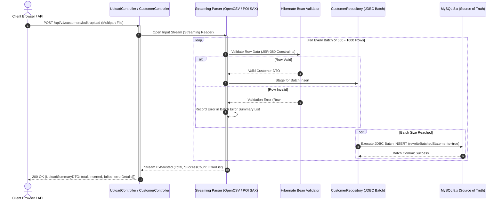
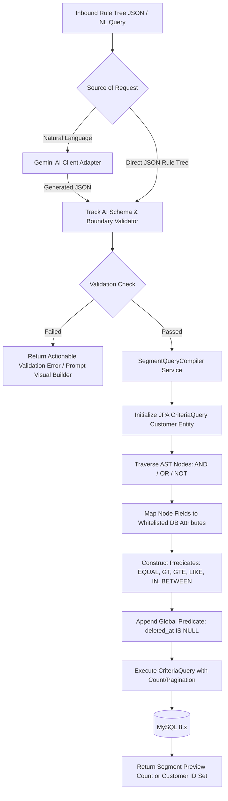
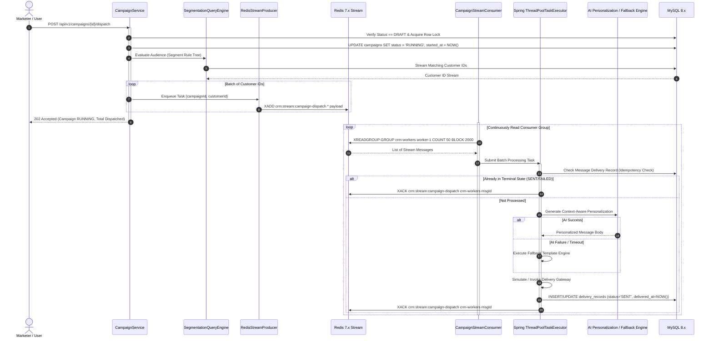
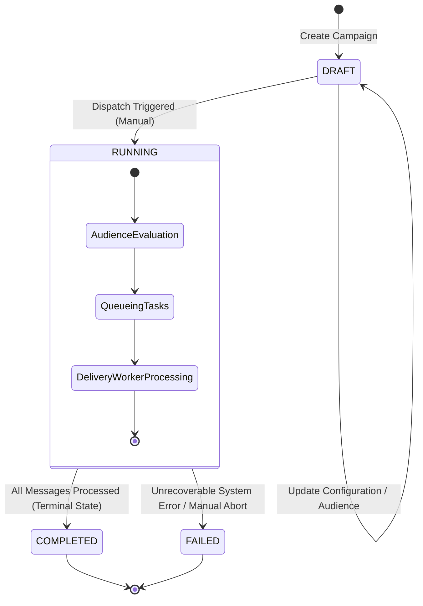
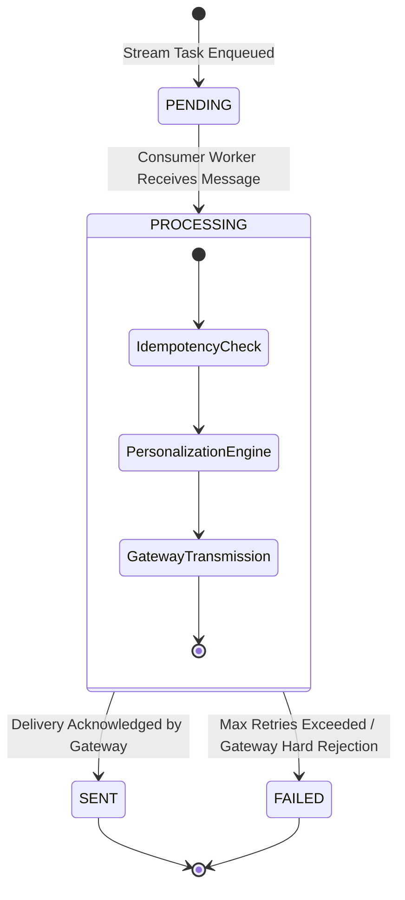

# System Architecture Document
## Enterprise AI-CRM Platform (`CS-CRM-2026`)

---

### Document Metadata
- **Project Code:** CS-CRM-2026
- **System Name:** Enterprise AI-CRM Platform
- **Course / Context:** Advanced Java Programming & Enterprise Systems
- **Document Version:** 1.1.0
- **Status:** Approved Architecture (M7-M12 Backend Implementation Complete)
- **Author:** System Architecture & Engineering Team
- **Date:** 2026-09-23
- **Primary Source of Truth:** [Software Requirements Specification (docs/SRS.md)](file:///c:/Users/ANSHUL%20GAUTAM/OneDrive/Desktop/CLG-CRM/docs/SRS.md)
- **Target Audience:** Academic Evaluators, Software Architecture Reviewers, Backend Implementation Engineers, Technical Leads

---

## 1. Executive Summary & Architectural Vision

The **Enterprise AI-CRM Platform (`CS-CRM-2026`)** is an enterprise-grade customer relationship management and intelligent campaign automation platform. It is engineered to support high-volume customer ingestion, expressive dynamic customer segmentation over datasets scaling to 1,000,000+ records, context-aware AI personalization, resilient asynchronous campaign dispatching, and comprehensive regulatory auditability.

The system is constructed as a **Modular Monolith** in Java 17 and Spring Boot 3.x, enforcing clean domain boundaries, strict layered architectural separation, and decoupled asynchronous messaging via Redis Streams. **MySQL 8.x serves as the sole persistent source of truth** for all core business domains, compliance records, and transactional states. **Redis 7.x operates strictly as transient/asynchronous infrastructure** (stream-based message queue and transient task idempotency buffer). External Generative AI integrations are isolated behind multi-tier resilience fallbacks (standard timeouts, bounded retries, and local template fallbacks), strict payload minimisation, and dual-track output validation gates to guarantee deterministic operational reliability.

```
+----------------------------------------------------------------------------------------------------+
|                                    ENTERPRISE AI-CRM (CS-CRM-2026)                                  |
+----------------------------------------------------------------------------------------------------+
|  Presentation:  RESTful API Controllers (Spring MVC) | OpenAPI / Swagger Documentation              |
+----------------------------------------------------------------------------------------------------+
|  Application:   Domain Services | DTO Assemblers | Transaction Boundaries (@Transactional)          |
+----------------------------------------------------------------------------------------------------+
|  Core Domain:   Customers | Dynamic Rule Tree Segmentation | Campaigns | Audit Logs | AI Adapters  |
+----------------------------------------------------------------------------------------------------+
|  Data & Infra:  Spring Data JPA + Hibernate Criteria API | MySQL 8.x (Single Source of Truth)      |
|                 Redis Streams & Lettuce Driver (Transient Queue & Worker Consumer)                 |
|                 External Generative AI Provider (Enforced Fallback to Local Deterministic Engine)   |
+----------------------------------------------------------------------------------------------------+
```

---

## 2. Core Architectural Principles & Decision Classifications

### 2.1 Foundational Architecture Principles

1. **Strict Source-of-Truth Separation:** MySQL 8.x is the sole persistent and authoritative store for all customer records, segment definitions, campaign states, delivery statuses, audit logs, and security credentials. Redis state is strictly ephemeral; any crash, flush, or eviction in Redis can be safely reconstructed or reconciled from MySQL.
2. **Deterministic Fallback for Non-Deterministic AI:** All generative AI interactions (natural language segment generation, message personalization, campaign performance summarization) are treated as unreliable external dependencies. The core platform must remain fully functional even when external AI providers fail, rate-limit, or produce invalid syntax.
3. **Fail-Safe Asynchronous Campaign Dispatch:** Campaign scheduling and high-volume message delivery must never block web tier worker threads. Campaign dispatches are buffered into durable stream partitions with consumer-group idempotency and explicit acknowledgment.
4. **Defense in Depth & Zero-Trust Domain Boundary:** All boundary inputs (bulk files, JSON rule trees, LLM text/payload outputs, JWT headers) are aggressively sanitized and validated before crossing service or persistence thresholds.
5. **Architectural Traceability:** Every structural component, worker thread pool, index strategy, and buffer rule maps directly to requirements specified in [SRS.md](file:///c:/Users/ANSHUL%20GAUTAM/OneDrive/Desktop/CLG-CRM/docs/SRS.md).

### 2.2 Decision Classification Scheme
To preserve governance clarity across reviews and prevent premature architectural lock-in, all technical determinations are classified using the following taxonomy:
- **`[DECIDED]`**: Formally approved architectural standard; mandatory for implementation.
- **`[RECOMMENDED]`**: Approved target pattern; implementation may refine parameters during detail design.
- **`[REQUIRES TESTING]`**: Architecture is bounded, but specific thresholds (batch sizes, timeouts, flush intervals) must be finalized through empirical performance benchmarks.
- **`[DEFERRED]`**: Explicitly scoped to a subsequent design phase (e.g., Security Design, Phase 3 Multi-Tenancy).
- **`[OUT OF SCOPE]`**: Explicitly excluded from the current v1 implementation scope.

---

## 3. Key Architectural Decisions (AD-01 to AD-10)

### AD-01: Overall Architectural Style
- **Classification:** `[DECIDED]`
- **Decision:** **Modular Monolith** with strict layered architecture and explicit domain boundary isolation.
- **Rationale:** 
  - Aligns with the single-deployment model required by the project scope while eliminating the operational complexity, network latency, distributed transaction failure modes (2PC/Saga), and deployment overhead of microservices.
  - Domain packages maintain high internal cohesion and loose inter-package coupling, allowing future decomposition into independent microservices if organizational scale demands it.
- **Alternatives Considered & Rejected:**
  - *Microservices Architecture:* Rejected due to severe operational complexity, distributed consistency challenges with financial/audit data, and lack of team-level multi-service deployment requirements.
  - *Unstructured Layered Monolith:* Rejected due to risk of cyclic dependencies and tight coupling across business domains.

### AD-02: Persistence & Relational Data Management
- **Classification:** `[DECIDED]`
- **Decision:** **MySQL 8.x** utilizing InnoDB engine with `READ_COMMITTED` transaction isolation, foreign key constraints, UTF-8 (`utf8mb4`) encoding, and standard B-Tree/Composite indexing.
- **Rationale:** 
  - Fulfills ACID transaction guarantees required for financial metrics (`total_spent`), compliance tracking, and campaign state transitions.
  - Native JSON support enables structured storage of dynamic segmentation rule trees and raw AI diagnostic metadata.
- **Strict Constraint:** MySQL is the **sole persistent source of truth**. No auxiliary persistent store (e.g., PostgreSQL, MongoDB) is permitted.

### AD-03: Asynchronous Messaging & Buffering Infrastructure
- **Classification:** `[DECIDED]`
- **Decision:** **Redis 7.x Streams** managed via Spring Data Redis and the Lettuce connection library.
- **Rationale:**
  - Redis Streams provides durable consumer group semantics (`XADD`, `XREADGROUP`, `XACK`, `XPENDING`, `XCLAIM`), allowing multi-worker parallel consumption, persistent offset tracking within the consumer group, and at-least-once message delivery without deploying an external enterprise messaging cluster (e.g., Kafka/RabbitMQ).
  - Memory-efficient data structures support fast task buffering during campaign execution spikes.
- **Strict Constraint:** Redis is **strictly transient infrastructure**. Loss or eviction of Redis data must never compromise persistent business records.

### AD-04: AI Integration & Resilience Fallback Architecture
- **Classification:** `[DECIDED]`
- **Decision:** Multi-tier fallback architecture isolating external Generative AI providers (Gemini API / OpenAI API) behind resilience boundaries (standard bounded HTTP connection timeouts, Spring-managed retries with exponential backoff, and strict local template fallbacks. External circuit-breaker libraries such as Resilience4j are unapproved in v1 and deferred pending explicit architectural approval).
- **Behavior:**
  - *Segmentation:* If NL-to-Rule-Tree translation fails or is invalid, the user receives an actionable validation error and fallback to the manual Visual Rule Builder.
  - *Campaign Personalization:* If external personalization fails or times out, the system automatically falls back to deterministic local template engine interpolation (e.g., regex substitution with customer profile variables) without failing the delivery run.
  - *Campaign Summarization:* If AI metrics narrative generation fails, standard statistical reporting tables are displayed directly.

### AD-05: Asynchronous Worker Execution Model
- **Classification:** `[DECIDED]`
- **Decision:** Dedicated background consumer thread pool (`StreamMessageListenerContainer` / custom polling worker) coupled with Spring's `ThreadPoolTaskExecutor` for message processing.
- **Relationship Clarification:**
  - Redis Stream consumers pull partitioned batches from the campaign stream (`crm:stream:campaign-dispatch`) via `XREADGROUP`.
  - The consumer decouples ingestion from execution by submitting discrete delivery processing jobs into a bounded, monitored Spring `ThreadPoolTaskExecutor`.
  - Prevents thread starvation on the core web container (Tomcat) and ensures controlled backpressure against downstream third-party email/SMS gateways and AI endpoints.

### AD-06: In-Memory Caching (Explicitly Out of Scope for v1)
- **Classification:** `[OUT OF SCOPE / DEFERRED]`
- **Decision:** **No Redis Caching in v1**. Caching layers (such as Redis Cache-Aside or Spring Cache) are **NOT approved** for the v1 implementation.
- **Rationale & Scope Constraint:** 
  - The approved SRS defines Redis strictly for transient asynchronous buffering, queuing, and related transient processing needs. 
  - All persistent CRM entity queries in v1 read directly from indexed MySQL 8.x tables. 
  - Caching is deferred as an unapproved optimization until empirical read bottlenecks demonstrate necessity and proper cache-invalidation schemes are formally approved.

### AD-07: Security & Authentication Framework
- **Classification:** `[DECIDED]` *(M4 Security Baseline Frozen)*
- **Decision:** Stateless **JWT (JSON Web Token)** authentication integrated with **Spring Security 6.x** and role-based access control across exactly two roles: `ROLE_ADMIN` and `ROLE_MARKETER` (`ROLE_ADMIN > ROLE_MARKETER`).
- **Baseline Security Parameters (Frozen in M4):**
  - Cryptographic signing: `HS256` (HMAC-SHA256) with mandatory `JWT_SECRET` (fails fast on startup if missing or < 32 UTF-8 bytes).
  - Access token lifetime: exactly 1 hour (3,600,000 ms).
  - Refresh tokens: NOT implemented in M4.
  - Live database authority: On every request, after cryptographic token validation, the filter chain reloads the user from MySQL, checks `users.is_active` (401 via `AuthenticationEntryPoint` if inactive), and assigns current DB role as authoritative `GrantedAuthority` (no Redis denylist).
  - Initial admin bootstrap: Executes only when `users` table is empty (`count == 0`).

### AD-08: AI Personalization Windowed Batching Strategy
- **Classification:** `[RECOMMENDED / REQUIRES TESTING]`
- **Decision:** **Bounded Batch Accumulator** within the Redis stream campaign worker.
- **Architecture:**
  - Campaign dispatches emit granular `{campaignId, customerId}` task records into Redis Streams.
  - The delivery worker maintains an in-memory batch accumulator where **batch size and batch window are configurable and will be finalized through performance, cost, token-limit, and reliability testing**.
  - The aggregated batch is submitted to the AI provider in a single vectorized payload, amortizing network TLS handshakes and prompt tokens.
  - Individual message delivery records in MySQL are updated per customer result, followed by discrete `XACK` per completed message. If the AI batch fails completely, fallback template interpolation executes immediately across all items in that batch.
- **Testing Requirement:** Batch size and batch latency window are configurable parameters and will be finalized through empirical performance, cost, token-limit, and reliability testing. No premature numerical bounds are frozen in v1 architecture.

### AD-09: Dynamic Segmentation Query Engine
- **Classification:** `[DECIDED]`
- **Decision:** **Spring Data JPA Criteria API** dynamically compiled from validated in-memory JSON Rule Tree structures.
- **Rationale:**
  - Eliminates SQL injection vulnerabilities inherent in runtime dynamic JPQL/SQL string concatenation.
  - Produces type-safe, database-portable predicate trees.
  - Allows seamless composition of arbitrary boolean logic (`AND`, `OR`, `NOT`) across customer behavioral, demographic, and financial fields.

### AD-10: Bulk Customer Ingestion Lifecycle & Concurrency Model
- **Classification:** `[DECIDED]`
- **Decision:** **Synchronous Streaming Ingestion Pipeline with Batch Persistence**.
- **Execution Model:**
  - Client initiates an HTTP `POST /api/v1/customers/bulk-upload` (multipart form with CSV or XLSX).
  - The HTTP request thread remains open while the server uses memory-efficient streaming readers: **OpenCSV** (for CSV) and **Apache POI EventUserModel / Streaming SAX** (for XLSX) to process rows iteratively without loading the full file into JVM heap.
  - Records are validated in-stream using Hibernate Validator / Bean Validation.
  - Validated records are accumulated into chunks of $B = 500 \text{ to } 1,000$ rows and flushed to MySQL via JDBC batch inserts (`rewriteBatchedStatements=true`).
  - The client receives a synchronous `200 OK` response containing total rows processed, successful insertions, skipped rows, and an array of specific row validation failures.
  - **Asynchronous Acceptance Deferred:** Asynchronous ingestion (submitting file, returning `202 Accepted` with a tracking `jobId`) is deferred to Phase 3 scaling should client HTTP timeout limits be reached on large payloads.

---

## 4. System Layering & Module Architecture

```
+---------------------------------------------------------------------------------------------------------+
|                                        PRESENTATION LAYER                                               |
|  [AuthController]  [CustomerController]  [UploadController]  [SegmentController]  [CampaignController]  |
|  [DeliveryController]  [ReportingController]  [AuditController]                                         |
|  - Request Body Validation (@Valid, JSR-380)                                                           |
|  - DTO Serialization / Deserialization (Jackson)                                                        |
|  - HTTP Status Code Mapping & Global Exception Translation (GlobalExceptionHandler)                    |
+---------------------------------------------------------------------------------------------------------+
                                                     |
                                                     v
+---------------------------------------------------------------------------------------------------------+
|                                        APPLICATION / SERVICE LAYER                                      |
|  [AuthService]     [CustomerService]    [UploadService]       [SegmentService]      [CampaignService]   |
|  [DeliveryService] [ReportingService]   [AuditService]                                                  |
|  - Declarative Transaction Boundaries (@Transactional)                                                  |
|  - Domain Orchestration & Business Invariant Enforcement                                                |
|  - Security Context Propagation (SecurityContextHolder)                                                 |
|  - Audit Event Publication via Spring ApplicationEventPublisher                                         |
+---------------------------------------------------------------------------------------------------------+
                    |                                         |                            |
                    v                                         v                            v
+------------------------------------+   +---------------------------------+  +---------------------------+
|          PERSISTENCE LAYER         |   |      ASYNC & MESSAGING LAYER    |  |     AI INTEGRATION LAYER  |
|  [Spring Data JPA Repositories]    |   |  [RedisStreamProducer]          |  |  [GeminiAiClientAdapter]  |
|  [CriteriaBuilder Query Engine]    |   |  [CampaignStreamConsumer]       |  |  [PromptBuilderService]   |
|  - Hibernate 6.x ORM               |   |  [DeliveryWorkerPool]           |  |  [TwoTrackValidator]      |
|  - Entity Listeners & Audit Logs   |   |  - Lettuce Driver               |  |  [Timeout & Fallback]     |
|  - Optimized Composite Indexes     |   |  - Consumer Groups & PEL Mgmt   |  |  [FallbackTemplateEngine] |
+------------------------------------+   +---------------------------------+  +---------------------------+
                    |                                         |                            |
                    v                                         v                            v
+------------------------------------+   +---------------------------------+  +---------------------------+
|            MySQL 8.x               |   |           Redis 7.x             |  |   External AI Providers   |
|  (Sole Persistent Source of Truth) |   |   (Transient Queue & Buffer)    |  |   (Google Gemini / OpenAI)|
+------------------------------------+   +---------------------------------+  +---------------------------+
```

### 4.1 Domain Decomposition & Package Architecture Mapping

To maintain strict alignment with the SRS while supporting clean Java/Spring packaging, the 8 canonical SRS domains are preserved and explicitly mapped to internal package structures. These package structures represent internal structural refinements for modularity, not alterations to the SRS domain scope:

| Canonical SRS Domain | Internal Implementation Package | Core Responsibilities | Inbound Dependencies | Outbound Dependencies |
| :--- | :--- | :--- | :--- | :--- |
| **`auth`** | `com.crm.security` & `com.crm.user` | User account management, password hashing (BCrypt), JWT creation/validation, RBAC security filter chain. | Web Layer | Persistence Layer |
| **`customer`** | `com.crm.customer` | Customer CRUD operations, profile search, soft-delete filtering, customer activity views. | Web Layer | Persistence Layer, `audit` |
| **`upload`** | `com.crm.customer.upload` (or `com.crm.upload`) | Streaming bulk customer ingestion (CSV via OpenCSV, XLSX via POI SAX), in-stream validation, JDBC batch persistence. | Web Layer | `customer`, Persistence Layer, `audit` |
| **`segment`** | `com.crm.segmentation` | Dynamic rule tree parsing, AST validation, dynamic JPA Criteria API query compilation, audience size preview. | Web Layer, `campaign` | Persistence Layer, `ai` |
| **`campaign`** | `com.crm.campaign` | Campaign lifecycle state management (`DRAFT` $\to$ `RUNNING` $\to$ `COMPLETED`/`FAILED`), audience query invocation, dispatch triggering. | Web Layer | `segment`, `delivery`, `ai`, Persistence Layer |
| **`delivery`** | `com.crm.campaign.delivery` (or `com.crm.delivery`) | Redis Streams enqueueing/dequeueing, delivery worker pool execution, customer idempotency verification, delivery state tracking (`PENDING`, `SENT`, `FAILED`). | `campaign` | Redis Streams, MySQL Persistence, `ai` |
| **`ai`** | `com.crm.ai` | Natural language to rule-tree conversion, context-aware message personalization, campaign summarization, fallback template engine. | `segment`, `campaign`, `delivery` | External AI Provider, Local Template Engine |
| **`reporting`** | `com.crm.reporting` (or `com.crm.analytics`) | Campaign delivery statistics computation, aggregate open/click/status reporting, CSV/PDF export generation. | Web Layer | `campaign`, `delivery`, Persistence Layer |
| *Cross-Cutting: `audit`* | `com.crm.audit` | Immutable audit trail event listening and logging for all domain mutations. | All Domains | Persistence Layer |
| *Cross-Cutting: `common`*| `com.crm.common` | Shared DTOs, custom exception definitions, global API response envelopes, base utilities. | All Modules | None |

### 4.2 Cross-Cutting Concerns
1. **Transaction Management:** Handled at the Application Service layer via Spring's `@Transactional`. Database mutations default to `REQUIRED`. Read-only operations declare `@Transactional(readOnly = true)` to optimize Hibernate dirty-checking and JDBC connection routing.
2. **Global Exception Handling:** Handled by a centralized `@RestControllerAdvice` component. Standardizes all error responses into RFC 7807 Problem Details format (`status`, `errorCode`, `message`, `timestamp`, `errors[]`).
3. **Audit Trail Automation:** Domain services fire domain events (`CustomerCreatedEvent`, `CampaignDispatchedEvent`) via Spring's `ApplicationEventPublisher`. The `AuditEventListener` captures events asynchronously or in-transaction and commits immutable records to MySQL `audit_logs` without contaminating business workflows.

---

## 5. Component & Data Flow Pipelines

### 5.1 Pipeline 1: Bulk Customer Ingestion Pipeline (Synchronous Streaming)



### 5.2 Pipeline 2: Dynamic Segmentation Query Generation Pipeline



### 5.3 Pipeline 3: Campaign Dispatch & Asynchronous Message Processing



---

## 6. Detailed Redis Streams Idempotency & Acknowledgment Lifecycle

To satisfy the strict requirement that **MySQL is the sole source of truth** while Redis handles high-volume transient queuing, message processing follows an explicit at-least-once, idempotent delivery lifecycle.

```
       +-------------------------------------------------------------+
       | Redis Stream Task: { campaignId, customerId, messageId }    |
       +-------------------------------------------------------------+
                                      |
                                      v
                        +----------------------------+
                        |   XREADGROUP Execution     |
                        |   Message enters PEL       |
                        +----------------------------+
                                      |
                                      v
                        +----------------------------+
                        |  MySQL Idempotency Check   |
                        |  Query delivery_records    |
                        +----------------------------+
                                      |
                 +--------------------+--------------------+
                 |                                         |
                 v                                         v
       [Record Found in Terminal]                [No Terminal Record]
       [State: SENT or FAILED]                             |
                 |                                         v
                 |                           +----------------------------+
                 |                           |  Execute AI / Fallback     |
                 |                           |  Personalization Engine    |
                 |                           +----------------------------+
                 |                                         |
                 |                                         v
                 |                           +----------------------------+
                 |                           |  Dispatch via Gateway      |
                 |                           +----------------------------+
                 |                                         |
                 |                                         v
                 |                           +----------------------------+
                 |                           |  MySQL Atomic Mutation:    |
                 |                           |  INSERT/UPDATE record to   |
                 |                           |  'SENT' or 'FAILED'        |
                 |                           +----------------------------+
                 |                                         |
                 |       +---------------------------------+
                 |       | (Only upon MySQL commit success)
                 v       v
       +-------------------------------------------------------------+
       | Issue XACK: Message removed from Pending Entries List (PEL) |
       +-------------------------------------------------------------+
                                      |
                 +--------------------+--------------------+
                 | (If Crash or Exception occurs BEFORE    |
                 |  MySQL commit)                          |
                 v                                         v
       +----------------------------+            +----------------------------+
       | DO NOT XACK                |            | Background Sweeper:        |
       | Message remains in PEL     |            | XPENDING / XAUTOCLAIM      |
       +----------------------------+            | Retry up to MAX_RETRIES    |
                                                 | If Exceeded: Write FAILED  |
                                                 | to MySQL, Move to DLQ,     |
                                                 | and Issue XACK             |
                                                 +----------------------------+
```

### 6.1 State Reconciliation Rules
1. **First-Time Processing:**
   - Message consumed $\to$ Delivery attempted $\to$ MySQL `campaign_delivery_records` updated to `SENT` or `FAILED` $\to$ `XACK` executed.
2. **Redelivery / Worker Crash Recovery:**
   - On worker recovery, messages lingering in the Pending Entries List (PEL) are reclaimed via `XAUTOCLAIM`.
   - Before executing downstream delivery, the worker queries `campaign_delivery_records` in MySQL by unique constraint `(campaign_id, customer_id)`.
   - If a record already exists with terminal status (`SENT` or `FAILED`), duplicate processing is skipped, and the message is immediately acknowledged via `XACK`.
3. **Incomplete or Failed Processing:**
   - If processing throws an unhandled exception before MySQL commits, `XACK` is **never issued**.
   - The message remains in the PEL and is re-read on subsequent schedule sweeps.
   - If failure persists beyond `MAX_RETRY_ATTEMPTS = 3`, the worker writes a `FAILED` record to MySQL with error diagnostics, publishes the message to a Dead Letter Queue (`crm:stream:dead-letter`), and executes `XACK` on the primary stream.

---

## 7. AI Integration Architecture & Two-Track Output Validation

To prevent non-deterministic LLM behavior, prompt injection, and hallucinated schema corruption, all generative AI interactions pass through isolated adapters and are routed into **Two Distinct Output Validation Tracks**.

```
                           +-------------------------------------+
                           | External LLM Output (Gemini/OpenAI) |
                           +-------------------------------------+
                                              |
                       +----------------------+----------------------+
                       |                                             |
                       v                                             v
        [TRACK A: Structured Rule-Tree]               [TRACK B: Text Personalization]
                       |                                             |
        +------------------------------+              +------------------------------+
        | 1. JSON Structural Validation|              | 1. Non-Empty & Length Checks |
        |    - RFC 8259 Well-Formedness|              |    - Channel Length Bounds   |
        +------------------------------+              +------------------------------+
                       |                                             |
        +------------------------------+              +------------------------------+
        | 2. JSON Schema Conformance   |              | 2. PII / Token Guardrail     |
        |    - Validate AST structure  |              |    - Ensure customer token   |
        |    - "combinator", "rules"   |              |      integrity (e.g. {name}) |
        +------------------------------+              +------------------------------+
                       |                                             |
        +------------------------------+              +------------------------------+
        | 3. Domain Whitelist Checks   |              | 3. Sanitization & Safety     |
        |    - Field in [spend, city..]|              |    - Sanitize forbidden tags |
        |    - Op in [EQ, GT, LT, IN]  |              |    - Validate plain-text     |
        +------------------------------+              +------------------------------+
                       |                                             |
        +------------------------------+                             |
        | 4. Tree Complexity Bounds    |                             |
        |    - Configurable Max Depth  |                             |
        |    - Configurable Leaf Limit |                             |
        +------------------------------+                             |
                       |                                             |
                       v                                             v
        +------------------------------+              +------------------------------+
        | Convert to JPA Criteria Tree |              | Inject to Delivery Dispatch  |
        +------------------------------+              +------------------------------+
```

### 7.1 Track A: Structured JSON Rule-Tree Validation
Applies strictly to natural-language-to-segment-query translation (`FR-AI-001`, `FR-SEG-004`).
1. **JSON Syntax & Schema Validation:** Validates that the payload is valid JSON and adheres to the strict Abstract Syntax Tree (AST) schema (`combinator`: `AND`|`OR`, `rules`: array of leaf rules or nested groups).
2. **Field & Operator Whitelist Enforcement:** Every leaf node is verified against an immutable whitelist of allowed database columns (`total_spent`, `city`, `state`, `status`, `last_purchase_date`, `created_at`). Operators are restricted to `EQUALS`, `NOT_EQUALS`, `GREATER_THAN`, `LESS_THAN`, `IN`, `BETWEEN`. Any unrecognized attribute or operator is rejected immediately.
3. **Type & Value Validation:** Field values are coerced and verified against entity field types (e.g., numeric validation on `total_spent`, ISO-8601 validation on dates).
4. **Complexity & Depth Bounds:** To prevent denial-of-service via nested query explosion, the rule tree is constrained by a **configurable maximum nesting depth and leaf node limit, to be finalized during implementation/security/performance validation**.
5. **Fallback:** If validation fails at any stage, the system rejects the output, logs the failure with prompt diagnostics, and prompts the user to construct the segment via the Visual Rule Builder.

### 7.2 Track B: Unstructured Text Personalization & Reporting Validation
Applies to campaign message personalization (`FR-AI-002`) and performance summarization (`FR-AI-003`).
1. **Length Bounds:** Messages must conform to channel-specific bounds (e.g., SMS and Email length limits defined by delivery configurations).
2. **Template Variable Integrity:** Ensures required personalized tokens (e.g., `{firstName}`) were not dropped or corrupted into unresolvable hallucinated tags.
3. **Sanitization:** Strips executable script tags, raw HTML (for plain-text channels), and command injection vectors.
4. **Context Minimisation Rule:** Under no circumstances are raw customer PII attributes (passwords, complete email addresses, phone numbers) forwarded to external LLM prompts. Only non-identifiable demographic and transactional attributes (e.g., spend bracket, city, product category interest) are included in the prompt context.
5. **Fallback:** If personalization times out or fails validation, the message body is instantly generated via local deterministic template replacement (`"Hello " + customer.getFirstName() + ...`).

---

## 8. State Machines & Entity Lifecycles

### 8.1 Campaign Lifecycle State Machine (`FR-CAMP-003`, `FR-CAMP-005`)



#### Campaign State Transition Rules:
- **`DRAFT`**: The initial state upon creation. Configuration, schedule metadata, segment binding, and message templates may be mutated freely.
- **`DRAFT -> RUNNING`**: Triggered via `POST /api/v1/campaigns/{id}/dispatch`. The transition is guarded by a database row-level lock (`SELECT ... FOR UPDATE`). Validation confirms that the campaign is bound to a valid segment with count $> 0$.
- **`RUNNING -> COMPLETED`**: Terminal state. Transitioned automatically when all individual message delivery tasks in the campaign stream reach a terminal state (`SENT` or `FAILED`).
- **`RUNNING -> FAILED`**: Terminal state. Transitioned if the segment evaluation query fails catastrophically or the worker infrastructure encounters an unrecoverable failure.

### 8.2 Campaign Message Delivery Lifecycle



---

## 9. Non-Functional Architecture & Quality Attributes

### 9.1 Scalability & Concurrency Model
- **Thread Pool Segmentation:** The application maintains segregated `ThreadPoolTaskExecutor` instances to prevent cross-domain resource starvation:
  - `webMvcTaskExecutor`: Serves synchronous incoming REST HTTP requests (Tomcat pool default).
  - `campaignWorkerExecutor`: Dedicated pool for Redis consumer group delivery workers.
  - `aiTaskExecutor`: Dedicated pool for external HTTP AI client calls with bounded keep-alive connections and low max-capacity queues to fail fast under LLM provider degradation.
- **Database Connection Pooling:** Managed via **HikariCP**. Maximum pool size configured based on hardware core capacity:
  $$\text{Pool Size} = (\text{Core Count} \times 2) + \text{Effective Spindle Count}$$
  Configured with strict connection timeouts and leak detection thresholds.

### 9.2 Reliability, Fault Tolerance & Resilience
- **Database Level:** Relational integrity enforced via InnoDB constraints. All monetary values stored as exact `DECIMAL(12,2)` to prevent floating-point precision loss.
- **Resilience & Fallback Strategy:** Managed via bounded HTTP timeouts, Spring Retry policies with backoff, and immediate diversion to local template fallbacks upon external provider failure. External circuit-breaking frameworks (such as Resilience4j) are deferred to future revisions subject to explicit dependency approval.
- **Graceful Shutdown:** Configured via Spring Boot lifecycle hooks. In-flight HTTP requests and active worker batches are allowed up to 30 seconds to flush commits and acknowledge Redis streams before container termination.

### 9.3 Security Baseline Architecture
- **Stateless RBAC & Live Authority:** Security context is evaluated per-request via `JwtAuthenticationFilter`. Role boundaries strictly enforce access across exactly two canonical roles:
  - `ROLE_ADMIN`: Full administrative superset privilege, user provisioning/management, customer soft-deletion, and system-level configuration.
  - `ROLE_MARKETER`: Customer profile authoring, dynamic segment creation/preview, campaign launch, and reporting.
  - Role hierarchy: `ROLE_ADMIN > ROLE_MARKETER`.
  - Live authority invariant: On every request, after cryptographic token validation, the filter chain reloads the user from MySQL, verifies `users.is_active` (immediate 401 via `AuthenticationEntryPoint` if inactive), and assigns the current DB role as authoritative `GrantedAuthority` (DB role wins over diagnostic JWT role claim).
- **Injection Defenses:**
  - Dynamic SQL Injection: Fully eliminated via mandatory use of JPA Criteria API with typed parameter binding.
  - Cross-Site Scripting (XSS): Enforced via Jackson HTML escaping and response header security (`Content-Security-Policy`, `X-Content-Type-Options: nosniff`).
  - Path Traversal: Bulk upload file names are sanitized; file contents are processed entirely from memory input streams without persisting unverified temporary files to local disk.

### 9.4 Observability, Logging & Audit Architecture
- **Structured Logging:** Implemented via SLF4J and Logback with JSON formatting. Every log statement incorporates distributed correlation markers via MDC (Mapped Diagnostic Context): `traceId`, `userId`, `clientIp`.
- **Immutable Audit Trail:** All state-altering operations record an entry in the `audit_logs` table containing:
  `id`, `user_id`, `action`, `resource_type`, `resource_id`, `old_value` (JSON), `new_value` (JSON), `ip_address`, `timestamp`.
  Audit log records cannot be updated or deleted via application interfaces.

---

## 10. Architectural Risks, Trade-Offs & Mitigations

| ID | Risk Description | Severity | Architectural Mitigation |
| :--- | :--- | :--- | :--- |
| **R-01** | **Third-Party AI Rate Limiting & Outages:** External AI API failure halts campaign dispatch. | **HIGH** | Multi-tier fallback architecture (`AD-04`, `AD-08`). In-flight dispatches instantly fall back to local deterministic template replacement without interrupting delivery. |
| **R-02** | **Segmentation Performance on 1M Records:** Complex dynamic criteria queries cause table scans. | **HIGH** | **MySQL 8.x Index Strategy:** Composite B-Tree indexing targeting soft-delete and frequent query fields: `(deleted_at, total_spent)`, `(deleted_at, last_purchase_date)`, `(deleted_at, city)`. Dynamic queries automatically include `deleted_at IS NULL` to utilize compound indexes. Query execution is guarded by query timeout limits. |
| **R-03** | **JVM Memory Saturation during Bulk Uploads:** Uploading large customer files exhausts heap. | **HIGH** | Strict streaming architecture (`AD-10`). Uses OpenCSV streaming reader and Apache POI SAX/Streaming parser. Memory footprint remains constant $O(1)$ regardless of file row count. |
| **R-04** | **Duplicate Campaign Message Deliveries:** Consumer crash between delivery and stream acknowledgment. | **MEDIUM** | MySQL-backed idempotency check (`Section 6`). Before transmission, worker verifies unique constraint in `campaign_delivery_records`. Existing terminal records trigger an immediate `XACK`. |
| **R-05** | **Redis Node Failure / Memory Eviction:** Redis server crash during campaign execution. | **MEDIUM** | Redis eviction policy configured to `noeviction`. Redis state is strictly transient; active campaign progress and delivery states are recorded in MySQL. Incomplete campaigns can be resumed by querying MySQL for unacknowledged customer IDs. |
| **R-06** | **Unvalidated LLM Rule Generation:** LLM produces invalid or destructive criteria trees. | **HIGH** | Track A Output Validation (`Section 7.1`). Strict JSON schema parsing, field whitelisting, and complexity limits before compiler execution. |
| **R-07** | **Audit Trail Contention:** High-volume logging introduces database lock overhead. | **LOW** | Asynchronous decoupling via Spring `ApplicationEventPublisher` and dedicated audit writer pool. |

---

## 11. Traceability Matrix: SRS Requirements to Architecture

| SRS Requirement ID | Requirement Summary | Architectural Component / Decision |
| :--- | :--- | :--- |
| **FR-AUTH-001** to **004** | User authentication, RBAC, session management | `AD-07` Stateless Spring Security + JWT Filter Chain |
| **FR-CUST-001** to **005** | Customer management, soft-delete, audit trails | `com.crm.customer`, MySQL 8.x InnoDB, Soft-Delete Filter |
| **FR-UPLOAD-001** to **003**| Streaming bulk upload (CSV/XLSX), validation | `AD-10` Streaming OpenCSV & Apache POI SAX, JDBC Batching |
| **FR-SEG-001** to **004** | Dynamic segmentation, Rule Trees, NL generation | `AD-09` JPA Criteria API Compiler, `AD-04` AI Adapter |
| **FR-CAMP-001** to **005** | Campaign management, dispatch, message tracking | `AD-03` Redis Streams, `AD-05` Worker Pool, Campaign State Machine |
| **FR-AI-001** to **003** | NL segmentation, personalization, summarization | `AD-04` Resilience Fallbacks, `AD-08` Bounded Batching, Track A/B Validation |
| **FR-AUDIT-001** to **003**| Immutable auditing, change tracking, export | `com.crm.audit`, Spring Event Bus, MySQL `audit_logs` |
| **NFR-PERF-001** to **004**| Sub-second queries, high-throughput campaign dispatch| Streaming JDBC Batching, Composite Indexes, Thread Isolation |
| **NFR-SEC-001** to **005** | Least privilege, data sanitization, token security | JWT Validation, Context Minimisation Policy, Prepared Criteria |

---

## 12. Open Decisions Resolution & Phased Roadmap

| SRS Open Decision ID | Topic | Architecture Resolution Status | Architectural Specification / Next Step |
| :--- | :--- | :--- | :--- |
| **OD-AUTH-001** | JWT Lifetime & Refresh Strategy | `[RESOLVED / FROZEN]` | **Resolved in M4 Security Baseline:** HS256 signing, 1-hour access token lifetime, refresh tokens omitted in M4. |
| **OD-AUTH-002** | Token Revocation Mechanism | `[RESOLVED / FROZEN]` | **Resolved in M4 Security Baseline:** Live MySQL `users.is_active` check on every request; password changes do not revoke tokens; zero Redis denylist. |
| **OD-UPLOAD-001** | Maximum Bulk File Size & Row Limit | `[DEFERRED / REQUIRES TESTING]` | File-size and row limits remain deferred; exact operational thresholds must be established through performance and stress testing. |
| **OD-AI-001** | AI Personalization Batching Strategy | `[RECOMMENDED / REQUIRES TESTING]` | `AD-08` Bounded Accumulator. Batch size and batch window are configurable and will be finalized through performance, cost, token-limit, and reliability testing. |
| **OD-QUEUE-001** | Queue Technology Selection | `[DECIDED]` | `AD-03` **Redis Streams** selected as transient message queue for CS-CRM-2026. |
| **OD-ARCH-001** | Multi-Tenancy Architecture | `[DEFERRED]` | Multi-tenant org provisioning deferred to Phase 3. Architecture preserves tenant/data isolation hooks. |
| **OD-CAMP-001** | Automated Campaign Scheduling | `[DEFERRED]` | Out of scope for baseline. Campaign execution is manual/immediate (`DRAFT -> RUNNING`). |

---

## 13. Implementation Guardrails for Subsequent Design Phases

1. **Database Design Guardrails (Phase 2, Step 3):**
   - Must use MySQL 8.x InnoDB dialect exclusively.
   - Do not generate PostgreSQL-specific types (`jsonb`, partial indexes, custom enum types).
   - Foreign key constraints must be strictly defined across relational entities.
   - All timestamp columns must be defined as `TIMESTAMP` or `DATETIME(6)` in UTC.
2. **API Design Guardrails (Phase 2, Step 4):**
   - All endpoints must be versioned under `/api/v1/`.
   - Dynamic query endpoints must accept validated JSON payloads; no raw SQL/JPQL fragments permitted in API requests.
   - Bulk upload endpoint must expose clear multipart validation contracts and structured error reporting.
3. **Coding Guardrails (Phase 3 Implementation):**
   - Zero hardcoded secrets; all credentials (DB, Redis, AI API keys) must be resolved via Spring Environment and environment variables.
   - Core domain business logic must reside within service classes, not inside controllers or database triggers.

---

## 14. Revision History

| Version | Date | Author | Description | Status |
| :--- | :--- | :--- | :--- | :--- |
| 1.0.0 | 2026-09-18 | System Architecture & Engineering Team | Initial System Architecture Document baseline. | Approved |
| 1.0.1 | 2026-09-20 | System Architecture & Engineering Team | M4 Security Baseline Reconciliation: Removed stale AUDITOR role from AD-07 and Section 9.3; reaffirmed exactly two roles (ROLE_ADMIN > ROLE_MARKETER); documented live database role authority and is_active check; resolved OD-AUTH-001 and OD-AUTH-002 per frozen M4 security decisions. | Approved |
| 1.1.0 | 2026-09-23 | System Architecture & Engineering Team | M7-M12 Implementation Complete: Finalized Redis Streams transient transport (`crm:campaign:deliveries:stream`), worker consumer loop (`crm:delivery:workers`), pessimistic locking on campaign launch, Spring AI Gemini client integration with AST parsing & auditing, reporting engine, MDC request tracing, and Docker deployment. | Approved |
